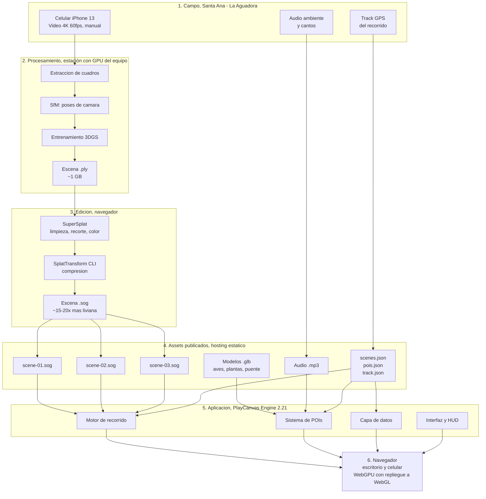
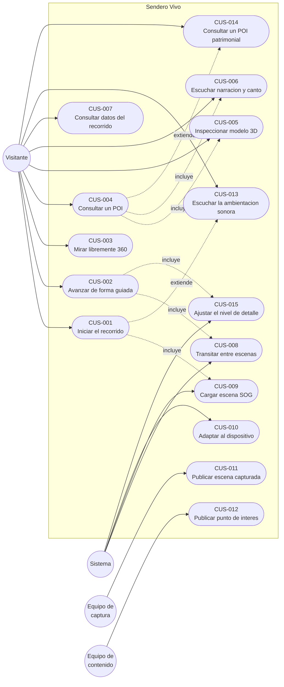
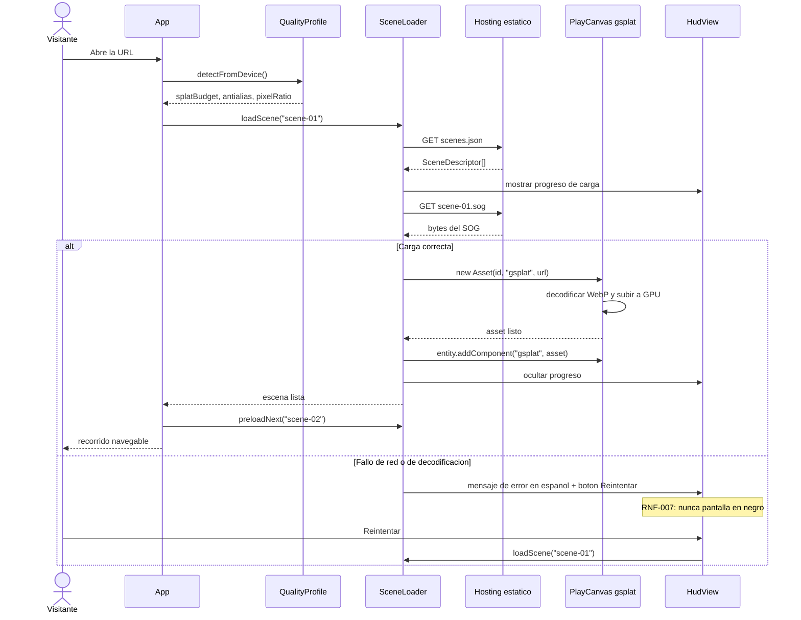
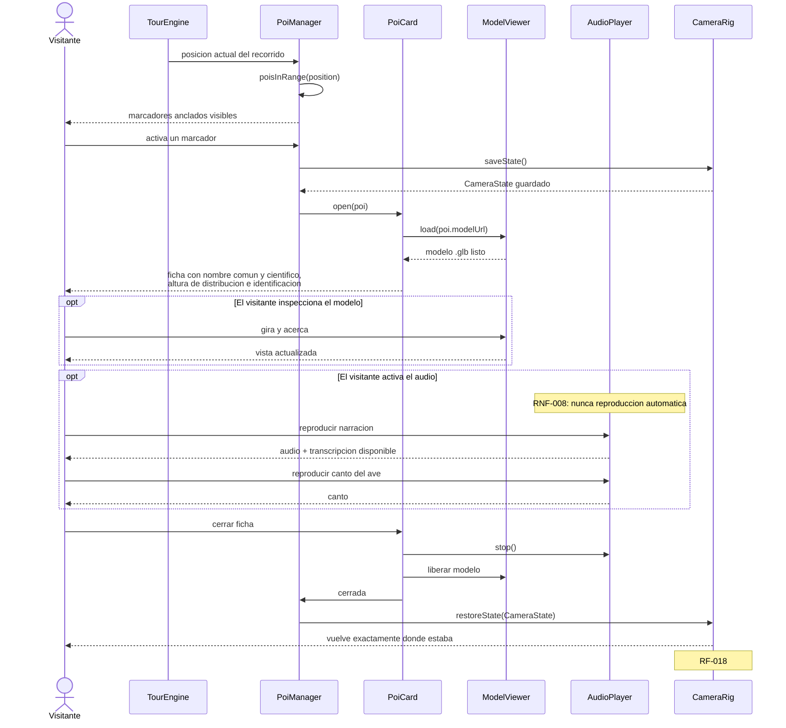
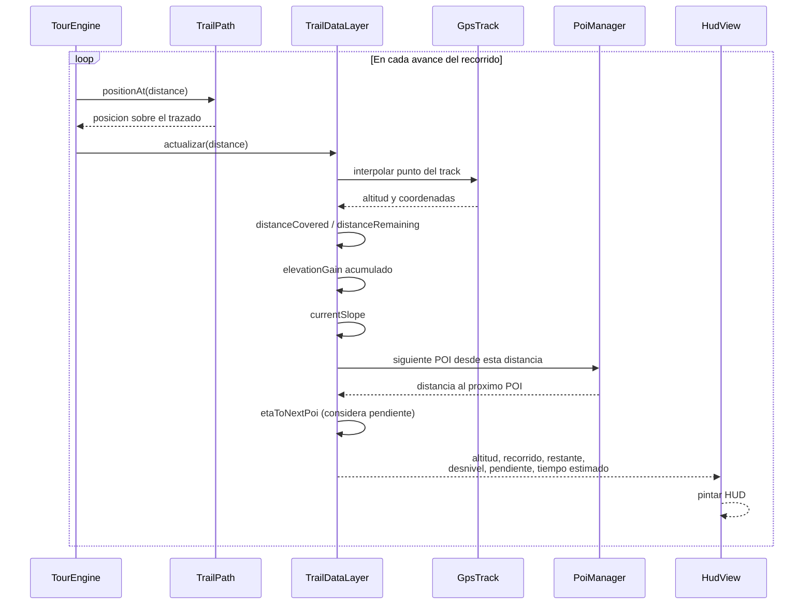
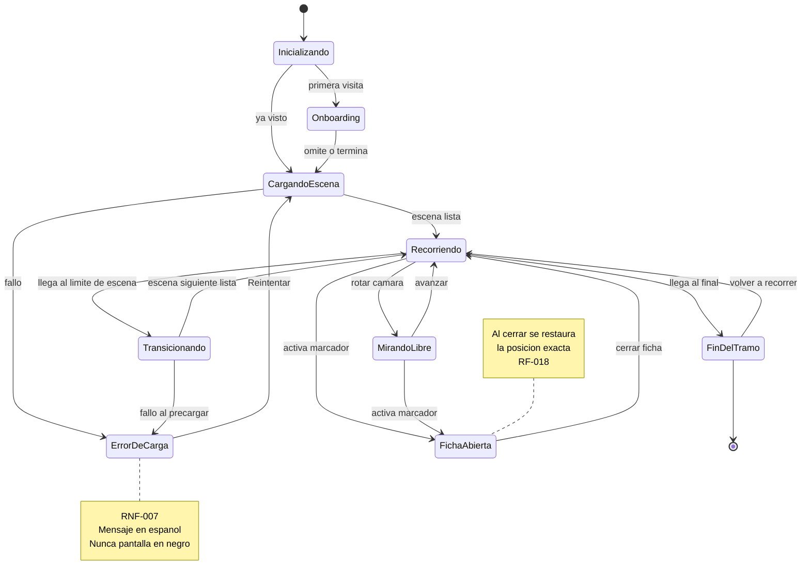

# Arquitectura y ámbitos: Sendero Vivo

> Versión 2,1, 26/08/2026 · Responsable: Juan Urrego (antes «arquitectura»; absorbe
> «ámbitos de los tres programadores», 09).
> Todos los diagramas están en Mermaid: GitHub los renderiza de forma nativa y una IA de código los lee como texto.
>
> **Cómo leer este documento:** describe el sistema completo, pero solo una parte existe hoy.
> Cada módulo del §3 está marcado como **[existe]** o **[previsto]** en la tabla de estado.
> Un agente que importe un módulo `[previsto]` va a fallar: primero se crea, respetando la
> firma de aquí. Las firmas de los módulos `[existe]` están verificadas contra el código real.
> La versión 2,1 añade el §3.1 (capas MVC) y actualiza el estado de los módulos.

---

## 1. Visión general

Sendero Vivo es una **aplicación web estática**. No hay servidor de aplicación, no hay base de datos, no hay cuentas de usuario. Todo lo que el visitante ve son archivos servidos por HTTPS: tres escenas en formato SOG, un puñado de modelos `.glb`, audio, y dos archivos de configuración declarativos (`scenes.json` y `pois.json`) que gobiernan el contenido.

Esa simplicidad es deliberada. El proyecto tiene el riesgo concentrado en la **producción de contenido** (capturar y reconstruir un bosque) y en el **rendimiento del render en móvil**, no en la lógica de negocio. Cualquier complejidad de backend sería complejidad prestada.

### 1.1 Arquitectura de alto nivel (captura → navegador)



### 1.2 Qué tecnología vive dónde

| Capa | Tecnología | Dónde corre |
|---|---|---|
| Captura | Celular, ajustes manuales | Campo |
| Reconstrucción | SfM + entrenamiento 3DGS | Estación con GPU del equipo |
| Edición | SuperSplat (MIT) | Navegador, local |
| Compresión | SplatTransform CLI | Local |
| Render y lógica | PlayCanvas Engine 2.21.3 (MIT) | Navegador del visitante |
| Entrega | Hosting estático + HTTPS | |

---

## 2. Casos de uso



| ID | Caso de uso | Actor |
|---|---|---|
| CUS-001 | Iniciar el recorrido virtual | Visitante |
| CUS-002 | Avanzar por el sendero de forma guiada | Visitante |
| CUS-003 | Mirar libremente en 360° | Visitante |
| CUS-004 | Consultar un punto de interés | Visitante |
| CUS-005 | Inspeccionar el modelo 3D de la ficha | Visitante |
| CUS-006 | Escuchar la narración y el canto del ave | Visitante |
| CUS-007 | Consultar los datos del recorrido en pantalla | Visitante |
| CUS-008 | Transitar entre escenas del tramo | Sistema |
| CUS-009 | Cargar y descomprimir una escena SOG | Sistema |
| CUS-010 | Adaptar la experiencia al dispositivo | Sistema |
| CUS-011 | Procesar y publicar una escena capturada | Equipo de captura |
| CUS-012 | Registrar y publicar un punto de interés | Equipo de contenido |
| CUS-013 | Escuchar la ambientación sonora espacial del recorrido | Visitante |
| CUS-014 | Consultar un punto de interés patrimonial o histórico | Visitante |
| CUS-015 | Ajustar el nivel de detalle según la proximidad al recorrido | Sistema |

---

## 3. Modelo de dominio (módulos y clases)

Nombres en **inglés**, según la convención del proyecto.

### 3.0 Estado real de los módulos (26/08/2026)

| Módulo | Estado | Dónde / nota |
|---|---|---|
| `TourEngine` | **[existe]** | `src/engine/TourEngine.js`. Firma real abajo. Hoy absorbe lo que se había previsto como `CameraRig` (yaw, pitch, límites, save/restore) |
| `TrailPath` | **[existe]** | `src/engine/TrailPath.js`. Con corredor lateral (`corridorRadius`) |
| `TrailMarkers` | **[existe]** | `src/engine/TrailMarkers.js`. Flechas 3D en el mundo, avance gradual. No estaba en el diseño original: nació en el prototipo |
| `TrailRecorder` | **[existe]** | `src/engine/TrailRecorder.js`. Editor del trazado (`?editor=1`), exporta `track.json` |
| `SceneLoader` | **[previsto]** | La carga del SOG vive hoy dentro de `src/app/main.js` |
| Overlay de carga/error | **[existe]** | `src/ui/shell.js` (RNF-007) |
| `CameraRig` | **disuelto** | Sus responsabilidades viven dentro de `TourEngine`. Si S4 exige separarlo, se extrae entonces |
| `PoiManager`, `PoiCard`, `ModelViewer` | **[existe]** | `src/poi/PoiManager.js`, `src/poi/PoiCard.js`, `src/poi/ModelViewer.js` |
| `TrailDataLayer`, `GpsTrack` | [previsto] | `src/data/` — David |
| `AmbienceController`, `SpatialAudioSource`, `AudioPlayer` | **[existe]** / [previsto] | `AmbienceController` en `src/audio/AmbienceController.js`; `SpatialAudioSource` y `AudioPlayer` siguen [previsto] |
| `QualityProfile`, `LodController` | [previsto] | `src/engine/` — Alejandra |
| `HudView` | [previsto] | `src/ui/` — Juan pinta, Eybar/Alberto diseñan. El prototipo tiene un HUD provisional dentro del hint |
| `WorldModel` | **[huérfano]** | `src/WorldModel.js`, nadie lo importa; `main.js:249` usa su propia `loadWorldModel()`. Se elimina en SW-02 (#77) |

```mermaid
classDiagram
    class TourEngine {
        -TrailPath trailPath
        -number distance
        -number yaw
        -number pitch
        -number eyeHeight
        +start() bool
        +stop() void
        +moveTo(distance) void
        +advance(delta) void
        +press(action) void
        +release(action) void
        +setEyeHeight(value) void
        +saveState() TourState
        +restoreState(state) void
    }

    class TrailMarkers {
        -TourEngine tour
        -number stepDistance
        -number walkSpeed
        +destroy() void
    }

    class TrailRecorder {
        -Vec3[] points
        +mark() void
        +undo() void
        +exportJson() void
    }

    class SceneLoader {
        +load(options) Promise~Entity~
        +waitForStableRender(options) Promise
    }

    class SceneDescriptor {
        +string id
        +number order
        +string sogUrl
        +Vector3 entryPoint
        +Vector3 exitPoint
        +string captureDate
    }

    class TrailPath {
        -Vec3[] waypoints
        -number corridorRadius
        -number eyeHeight
        +positionAt(distance, out) Vec3
        +directionAt(distance, out) Vec3
        +clampToTrail(position) number
        +clampToCorridor(position, out) Vec3
        +totalLength() number
        +isUsable bool
    }

    class PoiManager {
        -PoiDescriptor[] pois
        +loadFromConfig(url) Promise
        +poisInRange(position) PoiDescriptor[]
        +activate(poiId) void
        +close() void
    }

    class PoiDescriptor {
        +string id
        +string type
        +string commonName
        +string scientificName
        +Vector3 anchor
        +string modelUrl
        +string idleAnimation
        +string narrationUrl
        +string transcriptUrl
        +string birdCallUrl
        +string altitudeRange
        +string fieldIdTips
        +string sightingTips
        +string historicalNote
        +string period
        +string sourceUrl
    }

    class PoiCard {
        -ModelViewer viewer
        -AudioPlayer audio
        +open(poi) void
        +close() void
    }

    class ModelViewer {
        +load(modelUrl) Promise
        +playIdle(clipName) void
        +rotate(dx, dy) void
        +zoom(delta) void
    }

    class LodController {
        -number lodBaseDistance
        -number lodMultiplier
        +applyProfile(profile) void
    }

    class AmbienceController {
        -boolean started
        -boolean muted
        +startOnUserGesture() void
        +setMuted(value) void
        +sourcesInRange(distance) SoundSourceDescriptor[]
    }

    class SpatialAudioSource {
        -string panningModel
        -number refDistance
        -number maxDistance
        +activate() void
        +deactivate() void
    }

    class SoundSourceDescriptor {
        +string id
        +string url
        +Vector3 anchor
        +number distanceMeters
        +number refDistanceMeters
        +number maxDistanceMeters
        +boolean loop
    }

    class AudioPlayer {
        -boolean autoplayAllowed
        +play(url) void
        +stop() void
        +showTranscript() void
    }

    class TrailDataLayer {
        -GpsTrack track
        +altitudeAt(distance) number
        +distanceCovered() number
        +distanceRemaining() number
        +elevationGain() number
        +currentSlope() number
        +etaToNextPoi() number
    }

    class GpsTrack {
        +TrackPoint[] points
        +number totalDistance
        +number totalElevationGain
    }

    class QualityProfile {
        +number splatBudget
        +boolean antialias
        +number maxPixelRatio
        +number lodBaseDistance
        +number lodMultiplier
        +number maxSpatialAudioSources
        +detectFromDevice() QualityProfile
    }

    class HudView {
        +render(data) void
    }

    TourEngine --> TrailPath : restringe con
    TrailMarkers --> TourEngine : avanza via moveTo y advance
    TourEngine --> TrailDataLayer : consulta
    SceneLoader --> SceneDescriptor : lee
    SceneLoader --> QualityProfile : aplica
    PoiManager --> PoiDescriptor : gestiona
    PoiManager --> PoiCard : abre
    PoiCard --> ModelViewer : contiene
    PoiCard --> AudioPlayer : contiene
    TrailDataLayer --> GpsTrack : deriva de
    HudView --> TrailDataLayer : muestra
    PoiManager ..> TourEngine : pide guardar y restaurar camara
    TourEngine --> LodController : configura
    LodController --> QualityProfile : lee
    AmbienceController --> SpatialAudioSource : activa por distancia
    AmbienceController --> SoundSourceDescriptor : gestiona
    AmbienceController ..> QualityProfile : respeta maxSpatialAudioSources
    AmbienceController ..> TourEngine : escucha tour:progress
```

### 3.1 Las tres capas: Modelo, Vista y Controlador

El curso exige que el proyecto siga MVC. El código de hoy está organizado por
módulo técnico (`engine/`, `poi/`, `ui/`, `audio/`), no por capa: esta subsección
fija a qué capa pertenece cada archivo tal como está escrito ahora. El traslado de
carpetas es trabajo de SW-02, SW-03 y SW-04; aquí solo se decide el reparto.

**Las tres capas, en este proyecto:**

- **MODELO** — datos y reglas del dominio. No conoce la pantalla. No recibe `app`, no crea `Entity`, `Material` ni `Texture`, no toca el DOM. Puede usar tipos matemáticos de PlayCanvas (`Vec3`) porque son aritmética, no render. Se puede probar con números sueltos, sin motor y sin navegador.
- **VISTA** — todo lo que produce píxeles o DOM. Recibe datos ya decididos y los pinta. No decide nada: cuando el visitante actúa, publica la intención y se olvida.
- **CONTROLADOR** — escucha intenciones, cambia el Modelo y avisa a las Vistas. No pinta.

| Archivo | Capa | Por qué | Destino |
|---|---|---|---|
| `config/*.json` | Modelo | los datos del dominio; el código no los inventa | se queda donde está (no es código) |
| `src/engine/TrailPath.js` | Modelo | geometría pura: recibe distancias, devuelve posiciones; `clampToTrail` es regla de dominio (RF-004) | `src/models/` (SW-02, #77) |
| `src/engine/TourEngine.js` | Controlador | decide el avance, lee la entrada, publica `tour:progress`. El estado que guarda (`distance`, `yaw`, `pitch`, `eyeHeight`) es Modelo incrustado: se extrae como `TourState` en SW-02 | `src/controllers/` (SW-04, #81) |
| `src/engine/TrailMarkers.js` | Mixta | flechas 3D = Vista; picking y avance = Controlador. Se parte entre SW-03 y SW-04 | flechas → `src/views/` (#79); picking y avance → `src/controllers/` (#81) |
| `src/engine/TrailRecorder.js` | Controlador | herramienta de edición del trazado (`?editor=1`) | `src/controllers/` (SW-04, #81) |
| `src/poi/PoiManager.js` | Mixta | decide qué POI se abre = Controlador; crea las entidades de los marcadores = Vista. Se parte entre SW-03 y SW-04 | decisión → `src/controllers/` (#81); marcadores → `src/views/` (#79) |
| `src/poi/PoiCard.js` | Vista | la ficha en DOM. Ya se comporta como Vista: dispara `poi:request-close` y no cierra nada | `src/views/` (SW-03, #79) |
| `src/poi/ModelViewer.js` | Vista | visor 3D dentro de la ficha | `src/views/` (SW-03, #79) |
| `src/audio/AmbienceController.js` | Controlador | decide qué suena; no pinta | `src/controllers/` (SW-04, #81) |
| `src/ui/shell.js` | Vista | overlay, HUD y pestañas. Hoy incumple la capa: ver la nota de deuda | `src/views/` (SW-03, #79) |
| `src/app/main.js` | Controlador | arranque y cableado de todo | `src/controllers/` (SW-04, #81) |
| `src/WorldModel.js` | ninguna | código muerto, ver la nota de deuda | se elimina en SW-02 (#77) |
| `index.html` | Vista | el shell del visor | se queda donde está |
| `styles/*.css` | Vista | `tokens.css` es la única fuente de color | se queda donde está |

**Regla de comunicación.** Dos familias de eventos:

- Eventos de **intención**, `*:request-*`: los dispara la Vista, los escucha el Controlador. Significan «el visitante quiere esto»; nadie garantiza que pase.
- Eventos de **hecho**: los dispara el Controlador, los escuchan las Vistas. Significan «esto ya pasó, píntalo».

Todos van por el bus de PlayCanvas: `app.fire(nombre, payload)` y `app.on(nombre, handler)`. Espacios de nombres permitidos, lista cerrada: `tour:*`, `poi:*` y, cuando existan, `scene:*` y `audio:*`.

**Eventos vigentes:**

| Evento | Familia | Lo dispara | Lo escucha | Payload |
|---|---|---|---|---|
| `tour:progress` | Hecho | `TourEngine.js:216` | `main.js:518` | `{ distance, total, distanceMeters, position, yaw, pitch }` |
| `tour:eyeheight` | Hecho | `TourEngine.js:86` | `main.js:522` | número |
| `poi:open` | Hecho | `PoiManager.js:1009` | `PoiCard.js:40` y `PoiManager.js:78` | el objeto `poi` |
| `poi:close` | Hecho | `PoiManager.js:1028` | `PoiCard.js:45` y `PoiManager.js:83` | ninguno |
| `poi:request-close` | Intención | `PoiCard.js:671` y `:692` | `main.js:393` → `poiManager.closePoi()` | ninguno |

No existe `poi:selected`. El par real, ya en producción, es `poi:open` / `poi:close`.

**Deuda conocida (26/08/2026):**

- **`src/WorldModel.js` está huérfano y mal nombrado.** Nadie lo importa; `main.js:249` define su propia `loadWorldModel()` local. Pese al nombre, no es Modelo: crea `Entity` y la mete en la escena. Se elimina en SW-02 (#77).
- **`src/ui/shell.js` habla por globales `window.sendero*` en vez de por eventos.** Se carga como script clásico (`index.html:433`, sin `type="module"`) y llama métodos de Controlador directamente (`window.senderoAmbience.toggle()`, `window.senderoPoiManager`, entre otros). Se resuelve en SW-04 (#81).
- **`TrailMarkers` mezcla Vista y Controlador.** Crea las flechas (Vista) y además hace picking y mueve al visitante (Controlador). Se resuelve entre SW-03 (#79, flechas) y SW-04 (#81, picking y avance).
- **`PoiManager` mezcla Vista y Controlador.** Decide qué POI se abre (Controlador) y crea las entidades de los marcadores (Vista). Se resuelve entre SW-04 (#81, decisión) y SW-03 (#79, marcadores).

Estos cuatro incumplimientos están declarados y fechados, no descubiertos: son el trabajo de las historias siguientes.

### Notas de diseño

- **`TourEngine` es el único que mueve la cámara.** `PoiManager` no la toca: pide a `TourEngine` que guarde y restaure el estado (RF-018). Y es el único que escribe `distance`: los controles externos (flechas, botones) pasan por `moveTo()` / `advance()`.
- **`tour:progress` es el evento central.** Se publica con `app.fire('tour:progress', { distance, total, distanceMeters, position, yaw, pitch })` y se escucha con `app.on(...)`. `distanceMeters` va en `null` hasta que `TrailDataLayer` aporte la escala real.
- **`TrailPath.clampToTrail()` es el guardián de RF-004.** Ninguna posición llega a la cámara sin pasar por ahí. Es lo que impide el movimiento libre dentro de una reserva protegida.
- **`TrailDataLayer` no sabe nada de render.** Recibe una distancia recorrida y devuelve números. `HudView` los pinta. Esto permite probar la capa de datos sin motor.
- **`PoiDescriptor` se construye únicamente desde `pois.json`** (RF-021, RNF-009): añadir un POI no toca código. Lo mismo vale para `SoundSourceDescriptor` y `soundscape.json`.
- **`AmbienceController` no toca la cámara.** El oyente del audio espacial es la cámara activa, que ya mueve `TourEngine`; la espacialización se actualiza sola. El audio escucha `tour:progress` para decidir qué fuentes activar por distancia.
- **`LodController` es el único que escribe `lodBaseDistance` y `lodMultiplier`** (RF-027). Los lee de `QualityProfile`, no los codifica.
- **`ModelViewer.playIdle()` arranca la animación al abrir la ficha** (RF-029). Es la única animación que corre sin gesto del usuario, y se permite porque es visual: la regla de "nada automático" es del audio (RNF-008).

---

## 4. Flujos principales

### 4.1 Carga de una escena SOG (CUS-009)



### 4.2 Activación de un punto de interés (CUS-004, CUS-005, CUS-006)



### 4.3 Actualización de la capa de datos GPS (CUS-007)



---

## 5. Estados del ciclo de recorrido



---

## 6. Contratos de datos

Los cuatro archivos que gobiernan el contenido. **Cambiarlos es cambiar el producto; cambiar el motor no debería ser necesario para añadir contenido.** Esta sección es la **única copia canónica** de los contratos; los demás documentos enlazan aquí. Sincronizada con los archivos reales de `config/` el 18/08/2026.

> **Advertencia de unidades:** las coordenadas de `sceneWaypoints`, `anchor` y `sceneUp` están
> en **unidades del motor**, no en metros. La equivalencia unidades↔metros por escena se mide
> con el objeto de escala (validación V9) y todavía no existe.

### `scenes.json`

```json
{
  "version": 1,
  "trail": {
    "name": "Santa Ana - La Aguadora, circuito Bosque de Pinos, tramo de entrada",
    "totalLengthMeters": 200,
    "startAltitudeMeters": 2712,
    "elevationGainMeters": null,
    "averageSlopePercent": null
  },
  "scenes": [
    {
      "id": "scene-01",
      "order": 1,
      "sogUrl": "assets/scenes/scene-01/meta.json",
      "entryDistanceMeters": 0,
      "exitDistanceMeters": 70,
      "captureDate": "2026-08-17 (prototipo: parque de prueba, no el sendero)",
      "sceneUp": { "x": -0.204, "y": -0.879, "z": -0.431 },
      "sceneUpNote": "Vector 'arriba' real de la escena, promediado de las poses de cámara de COLMAP. El visor calcula con él la rotación que nivela el horizonte. Se recalcula por escena tras cada reconstrucción."
    }
  ]
}
```

> **`sogUrl` apunta al `meta.json` de la carpeta SOG desempaquetada** (`assets/scenes/<id>/`,
> `meta.json` + `.webp`), no a un `.sog` empaquetado: el `.sog` de una escena real (~70 MB)
> supera el límite de **25 MiB por archivo** de Cloudflare Pages. El visor también acepta un
> `.sog` en local y por `?sog=` para pruebas.
> **`sceneUp` es obligatorio en la práctica**: sin él la escena sale con la orientación
> arbitraria de COLMAP (la nuestra salía 151,5° torcida). Cómo medirlo:
> [`05-produccion-de-escenas.md`](05-produccion-de-escenas.md) §16.
> **200 m es el compromiso firme**, en tres etapas: 0–70, 70–140 y 140–200 m. Los cortes son provisionales y se ajustan en V1. `elevationGainMeters` y `averageSlopePercent` van en `null` a propósito: están **`[por medir en campo]`**. Las cifras de 340 m / 62 m / 9 % de versiones anteriores corresponden al tramo de referencia evaluado en ADR-001, no al tramo comprometido.
> **Ojo:** hoy `scene-01` es la **escena de práctica del parque**. Cuando llegue el material del sendero hay que renombrar o reservar identificadores.

### `pois.json`

```json
{
  "version": 1,
  "pois": [
    {
      "id": "poi-colibri-chillon",
      "type": "fauna",
      "commonName": "Colibrí chillón",
      "scientificName": "Colibri coruscans",
      "sceneId": "scene-01",
      "anchor": { "x": 0, "y": 0, "z": 0 },
      "distanceMeters": 0,
      "modelUrl": "assets/models/colibri-chillon.glb",
      "idleAnimation": "idle-flap",
      "narrationUrl": "assets/audio/colibri-narracion.mp3",
      "transcriptUrl": "assets/text/colibri-transcripcion.txt",
      "birdCallUrl": "assets/audio/colibri-canto.mp3",
      "altitudeRange": "1.700 – 3.500 msnm",
      "fieldIdTips": "[por completar]",
      "sightingTips": "[por completar tras V1]"
    },
    {
      "id": "poi-muro-antiguo",
      "type": "patrimonio",
      "commonName": "[por identificar en V1]",
      "sceneId": "scene-02",
      "anchor": { "x": 0, "y": 0, "z": 0 },
      "distanceMeters": 0,
      "modelUrl": "assets/models/muro-antiguo.glb",
      "historicalNote": "[por verificar]",
      "period": "[por verificar]",
      "sourceUrl": ""
    }
  ]
}
```

> `anchor` y `distanceMeters` quedan en `[por medir en campo]` hasta que existan las escenas reconstruidas y el track alineado.
> `type` admite `"fauna"`, `"flora"`, `"elemento"` y `"patrimonio"`. Los campos son por tipo: `idleAnimation`, `birdCallUrl` y `sightingTips` solo en `fauna`; `historicalNote`, `period` y `sourceUrl` solo en `patrimonio`, y **`sourceUrl` es obligatorio si la nota histórica afirma algo**.

### `soundscape.json`

```json
{
  "version": 1,
  "ambienceUrl": "assets/audio/ambience-bed.mp3",
  "sources": [
    {
      "id": "sound-stream-45",
      "label": "Cauce de la quebrada",
      "url": "assets/audio/stream-loop.mp3",
      "sceneId": "scene-01",
      "distanceMeters": 45,
      "anchor": { "x": 0, "y": 0, "z": 0 },
      "refDistanceMeters": 2,
      "maxDistanceMeters": 25,
      "loop": true
    }
  ]
}
```

> `ambienceUrl` es el lecho continuo: estéreo, **no posicional**. Cada entrada de `sources` es una fuente puntual espacializada con HRTF, grabada **en mono**. Las posiciones salen del mapa sonoro levantado en V1. `config/soundscape.json` **ya existe** como esqueleto con `sources` vacío. Diseño completo en [`06-contenido-de-la-experiencia.md`](06-contenido-de-la-experiencia.md) §C.

### `track.json` (trazado del recorrido + track GPS)

Forma real vigente (el prototipo ya lo consume):

```json
{
  "version": 1,
  "capturedOn": "[pendiente: fecha real de la salida de campo]",
  "note": "Trazado marcado sobre la escena con el editor del prototipo. Las coordenadas están en unidades del motor, no en metros.",
  "sceneWaypoints": [
    { "x": 2.942, "y": -0.488, "z": -2.205 },
    { "x": -8.766, "y": 0.942, "z": 5.889 }
  ],
  "points": [],
  "eyeHeight": 0,
  "corridorRadius": 1.5
}
```

> **`sceneWaypoints`** es el trazado en coordenadas de la escena: lo consume `TrailPath` y se
> marca visualmente con el editor (`?editor=1`, teclas M/Z/X). **`points`** queda reservado
> para el track GPS real (`{ lat, lon, altitudeMeters, distanceMeters }`), que se graba el
> día de la captura y alimenta a `TrailDataLayer`. **`eyeHeight`** levanta la cámara sobre los
> puntos marcados; **`corridorRadius`** es el margen lateral permitido (RF-004 sin camisa de
> fuerza). Se calibran en vivo con R/F y se anotan aquí.

---

## 7. Decisiones de arquitectura

| Decisión | Alternativas descartadas | Razón |
|---|---|---|
| **Gaussian Splatting sobre captura real** | Modelado 3D a mano; fotogrametría de malla; NeRF | El producto es que el visitante *reconozca* el lugar. Solo la captura da eso, y 3DGS es el único que además corre en tiempo real en el navegador |
| **Formato SOG** | PLY plano; Compressed PLY | ~15–20× más liviano que PLY; datos en orden Morton, listos para GPU sin procesar al cargar. Es lo que hace viable el móvil |
| **Tres escenas separadas** | Una sola escena para todo el tramo | Permite cargar solo lo necesario y precargar la siguiente. Una escena única excedería el presupuesto de gaussianas en móvil |
| **Sitio estático, sin backend** | API + base de datos; CMS | No hay cuentas, ni datos de usuario, ni contenido dinámico. Un backend sería complejidad prestada |
| **Contenido declarativo en JSON** | POIs y escenas escritos en código | RF-021 y RNF-009: el equipo de contenido añade un POI sin tocar el motor ni recompilar |
| **WebGPU con repliegue a WebGL** | Solo WebGL; solo WebGPU | WebGL no tiene cómputo general y el ordenamiento por profundidad se va a CPU. WebGPU es mucho mejor, pero exigirlo rompería RNF-004 |
| **Recorrido sobre trazado, sin movimiento libre** | Cámara libre tipo videojuego | El sendero está dentro de una reserva protegida: el producto no puede insinuar salirse del camino (RF-004, RNF-015). Además acota el volumen a capturar |
| **Modelos de ficha aparte de la escena** | Modelar aves y plantas dentro del splat | Un ave no se captura por fotogrametría: se mueve. Y separarlos permite que E3 avance en paralelo a E1 |
| **LOD por distancia de cámara como "detalle por proximidad"** | LOD por campo de visión; densidad uniforme; recortar lo lejano | La cámara va siempre sobre el trazado (RF-004), así que distancia a cámara ≡ distancia al recorrido. Un LOD por campo de visión parpadearía al rotar 360°. Ver ADR-002 |
| **Audio en dos capas: lecho estéreo + fuentes HRTF** | Pista de fondo sin espacializar; ambisónica; espacializar todo | El lecho da continuidad barata y las fuentes dan el espacio. Ambisónica exige micrófono que no tenemos. Ver ADR-003 |
| **La ambientación arranca con el gesto de iniciar el recorrido** | Arrancar al cargar la página | RNF-008 y las políticas de autoplay del navegador. El botón anuncia el sonido y ofrece iniciar en silencio |
| **Tipo de POI `patrimonio` en el mismo contrato** | Un contrato aparte para lo no vivo | Es el mismo flujo: marcador, ficha, modelo. Cambian los campos, no el mecanismo. Y así RNF-009 sigue valiendo |

---

## 8. Reglas para no romper la arquitectura

Invariantes. Una PR que rompa cualquiera de estas se rechaza sin discusión.

1. **La cámara la mueve solo `TourEngine`.** Ningún otro módulo escribe posición ni rotación de cámara. `PoiCard` pide guardar y restaurar; no toca.
2. **Ninguna posición llega a la cámara sin pasar por `TrailPath.clampToTrail()`.** Es la garantía de RF-004.
3. **`TrailDataLayer` no importa nada de PlayCanvas.** Recibe números, devuelve números. Si necesita render, está mal diseñado.
4. **Añadir un POI no toca código.** Si para añadir un POI hay que editar un `.js`, se rompió RNF-009.
5. **Añadir o reordenar una escena no toca código.** Todo vive en `scenes.json`.
6. **El audio nunca arranca solo.** Toda reproducción nace de un gesto del usuario (RNF-008).
7. **Ningún estado de carga o de error deja la pantalla en negro.** Siempre hay progreso, mensaje o reintento (RNF-007).
8. **Todo texto visible está en español; todo identificador de código, en inglés.** Sin mezclas.
9. **Los intermedios pesados y el material bruto nunca entran a Git.** `*.ply`, `*.sog`, `assets/raw/` y el video de captura están en `.gitignore`. **Excepción desde el 14/08/2026: las escenas en formato SOG _desempaquetado_ (`assets/scenes/<id>/`, `meta.json` + `.webp`) sí se versionan**, para que el despliegue por rama sirva una web funcional sin almacenamiento externo. Límites duros: **25 MiB por archivo en Cloudflare Pages** (por eso el desempaquetado, que reparte el peso) y 100 MB por archivo en GitHub.
10. **Nada de datos inventados.** Altitudes, distancias, nombres científicos y notas históricas se verifican o se marcan con la marca que corresponda: `[por medir en campo]`, `[por verificar]`, `[por completar]`, `[por definir …]` o `[por confirmar …]`. La lista es cerrada y las marcas **no se normalizan entre sí**: significan cosas distintas ([`02-manual-del-equipo.md`](02-manual-del-equipo.md) §9).
11. **Ninguna funcionalidad sin RF.** Si no traza a un requerimiento, o sobra la funcionalidad o falta el requerimiento, y entonces se agrega el requerimiento primero.
12. **`src/audio/` no toca la cámara y `src/engine/` no reproduce sonido.** El oyente del audio espacial es la cámara activa que ya mueve `TourEngine`.
13. **Ningún módulo lee la cámara para saber dónde está el visitante.** Se escucha `tour:progress`, que publica `distanceMeters`.
14. **Ningún archivo `.js` escribe un color literal.** Todo color sale de `styles/tokens.css`.
15. **Añadir una fuente de sonido no toca código.** Todo vive en `soundscape.json`.
16. **Las importaciones van en una sola dirección: Vista → Controlador → Modelo.** Un Modelo nunca importa una Vista ni un Controlador. Una Vista nunca importa un Controlador. Quien importa hacia arriba está mal colocado (§3.1).
17. **Una Vista no decide.** Si una Vista necesita que algo cambie, dispara un evento de intención (`*:request-*`) y se olvida. Decide el Controlador, que responde con un evento de hecho. Ninguna Vista llama a un método de Controlador (§3.1).

---

## 9. Estructura de carpetas (real al 19/08/2026)

```
SenderoVivo/
├── README.md
├── CONTEXTO-EQUIPO.md          ← puerta de entrada operativa del equipo y de los agentes
├── index.html                  La aplicación (shell del visor). Juan
├── _headers                    Cabeceras de caché para Cloudflare Pages
├── .gitignore
├── docs/
│   ├── 01-vision-y-alcance.md
│   ├── 02-manual-del-equipo.md
│   ├── 03-arquitectura.md      ← este documento
│   ├── 04-backlog.md
│   ├── 05-produccion-de-escenas.md
│   ├── 06-contenido-de-la-experiencia.md
│   ├── 07-tecnologia.md
│   ├── 08-de-video-a-web.md    Guía de máquina completa: videos → COLMAP → Brush →
│   │                           limpieza → empaques (SOG/streaming/móvil) → publicación
│   ├── F_Analisis_de_Requerimientos_V1,0_SenderoVivo.md  (+ .docx)
│   └── decisiones/
│       ├── ADR-001-eleccion-de-sendero.md
│       ├── ADR-002-lod-por-proximidad.md
│       ├── ADR-003-audio-binaural-espacial.md
│       └── ADR-004-reparto-de-ambitos.md
├── plan/
│   ├── plan_de_trabajo.md
│   ├── resumen-auditoria-2026-08-13.md
│   └── backlog-jira.csv        DEPRECADO (13/08): el backlog se edita en GitHub/Jira
├── scripts/
│   ├── escenas/                Pipeline de escenas: medir.js (radiografía de un PLY),
│   │                           filtrar.js (limpieza log-espacio sin cajas),
│   │                           muestrear.js (poda por importancia para móvil)
│   ├── modelos/                Pipeline de modelos: extraer_mb.py (parser del .mb de
│   │                           Maya) y ensamblar_glb.py (GLB con PBR embebido)
│   ├── setup_repo.sh           DEPRECADO (13/08): bootstrap ya ejecutado; historia
│   └── sync-github.mjs         DEPRECADO (13/08)
├── src/
│   ├── app/                    Juan:      main.js (orquestación)
│   ├── engine/                 Alejandra: TourEngine, TrailPath, TrailMarkers,
│   │                                      TrailRecorder, SceneLoader [existen]
│   │                                      QualityProfile, LodController [previstos]
│   ├── poi/                    David:     PoiManager, PoiCard, ModelViewer [previstos]
│   ├── data/                   David:     TrailDataLayer, GpsTrack [previstos]
│   ├── audio/                  David:     AmbienceController, SpatialAudioSource,
│   │                                      AudioPlayer [previstos]
│   └── ui/                     Juan:      overlay.js, tokens.js [existen] · HudView [previsto]
│                                          (diseño de Eybar + Alberto)
├── styles/                     Eybar + Alberto: tokens.css (única fuente de color), app.css
├── config/
│   ├── scenes.json
│   ├── pois.json
│   ├── track.json
│   └── soundscape.json         (esqueleto: sources vacío hasta V3)
└── assets/
    ├── raw/                    (ignorado por Git: video y capturas brutas)
    ├── scenes/                 VERSIONADAS (SOG desempaquetado): scene-01/ (respaldo),
    │                           scene-01-stream/ (streaming LOD, escritorio),
    │                           scene-01-movil/ (poda 1,2 M, celular) y scene-01-luma/;
    │                           los .sog y .ply sueltos siguen ignorados
    ├── models/                 marcador-provisional.glb · golondrina-plomiza.glb (convertido
    │                           19/08 con scripts/modelos/) · golondrina-plomiza-fuente/
    ├── audio/
    └── text/
```

> **Nota de deuda conocida:** el código de `src/app/` y `src/engine/` lo escribió Juan durante
> la semana del prototipo, incluida la parte que cae en carpeta de Alejandra. El dueño de la
> carpeta lo asume desde aquí; la excepción está fechada y no sienta precedente.

---

## 10. Ámbitos: quién toca qué

*(Absorbe el antiguo `03-arquitectura.md`. Esta tabla es la **única
copia** de la propiedad de carpetas; README, CONTEXTO-EQUIPO y el backlog enlazan aquí.)*

**Dueño de la carpeta ≠ responsable de la historia.** El dueño de carpeta es permanente
(ADR-004) y da el revisor por defecto; el responsable de una historia es semanal y puede
trabajar en carpeta ajena — entonces **revisa el dueño**. Excepción fechada de la semana de
prototipo (W02): Alejandra sobre `src/poi/` (HU-56, revisa David) y David en integración de
interfaz (revisa Juan).

| Carpeta | Dueño | Qué vive ahí |
|---|---|---|
| `src/app/` · `src/ui/` · `config/` · `index.html` | **Juan Urrego** | Orquestación, shell, overlay, HUD, contratos de datos |
| `src/engine/` | **Alejandra Chambueta** | Motor de recorrido, carga de escenas, cámara, LOD, rendimiento |
| `src/poi/` · `src/data/` · `src/audio/` | **David Beltrán** | POIs y fichas, capa de datos GPS, audio espacial |
| `styles/` | **Eybar Viasus y Alberto Alemán** | tokens.css (única fuente de color), componentes |
| `assets/models/` · `assets/audio/` | **Felipe Acevedo** | Modelos `.glb`, material de audio (`marcador-provisional.glb` lo subió Juan como puente declarado) |
| `assets/text/` | **Alberto Alemán** | Textos y transcripciones |
| `docs/` · `plan/` | **Juan Urrego** (cada doc con su responsable en cabecera) | Documentación |

**Las tres fronteras entre ámbitos, con las firmas reales del código:**

1. **Motor → Datos, POIs y Audio.** `TourEngine` publica
   `app.fire('tour:progress', { distance, total, distanceMeters, position, yaw, pitch })`.
   Los demás módulos escuchan con `app.on('tour:progress', …)`; **nadie lee la cámara** (invariante 13).
2. **POIs → Motor.** `PoiCard` llama a `tour.saveState()` al abrirse y `tour.restoreState(state)`
   al cerrarse (RF-018); no toca la cámara.
3. **Motor → Audio.** `QualityProfile` expondrá `maxSpatialAudioSources`; el audio lo respeta
   y no configura el motor. El oyente (`audiolistener`) ya está en la cámara.

**Cada dueño prueba en su URL de rama** (`https://dev-<nombre>.senderovivo.pages.dev`): el
despliegue por rama forma parte del ámbito — "toco mi carpeta" se demuestra con "se ve en mi URL".

---

## 11. Despliegue

| Qué | Cómo |
|---|---|
| Plataforma | **Cloudflare Pages**, proyecto `senderovivo`, conectado al repositorio de GitHub |
| Producción | Rama `develop` → <https://senderovivo.pages.dev> |
| Vista previa por rama | Cada push a `dev/<nombre>` → `https://dev-<nombre>.senderovivo.pages.dev` (1–2 min) |
| Build | Ninguno: sitio estático, se sirve el repositorio tal cual |
| Límite | **25 MiB por archivo** — por eso las escenas van en SOG desempaquetado |
| Caché | `_headers` fija un año de caché inmutable para `assets/scenes/*` |

Esto es lo que evita que seis personas se pisen en quince semanas: carpeta propia, rama propia, URL propia.
