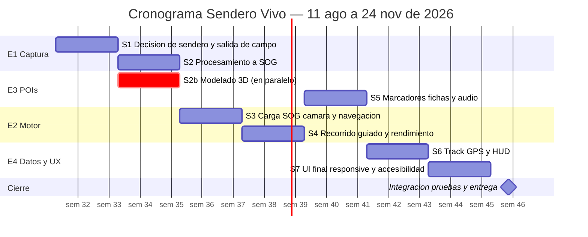

# Actividades y roles — Sendero Vivo

> Punto 3 de la actividad del curso: 4 épicas, 8 sprints de 2 semanas, actividades y roles.
> Inicio: **11 de agosto de 2026** · Cierre: **24 de noviembre de 2026**.

---

## 1. El equipo

| Persona | Rol | De qué responde | Épica que lidera |
|---|---|---|---|
| **Juan Urrego** | PM + Programador / Integrador | Arquitectura, contratos de datos, integración, despliegue. Deja los espacios listos para que los demás no se pisen | **E1** |
| **Felipe Acevedo** | Artista 3D | Modelado, animación y rigging de aves y plantas. Optimización de polígonos para web | **E3** (con David) |
| **Eybar Viasus** | Diseñador UI/UX | Ficha de POI, visor 3D, HUD de datos, sistema de diseño | **E4** (con Alberto) |
| **Alberto Alemán** | UI/UX | Onboarding, flujo de recorrido, responsive móvil, accesibilidad | **E4** (con Eybar) |
| **Alejandra Chambueta** | Programadora | Motor de recorrido, carga de escenas SOG, cámara y navegación, rendimiento | **E2** |
| **David Beltrán** | Programador | Sistema de POIs, panel de fichas, audio, capa de datos GPS | **E3** (con Felipe) |

---

## 2. Las 4 épicas

| ID | Épica | Responsable | Sprints | Qué entrega |
|---|---|---|---|---|
| **E1** | Captura y reconstrucción del tramo | Juan Urrego | S1, S2 | 3 escenas en SOG, limpias, publicadas y navegables en un visor, más el track GPS |
| **E2** | Motor de recorrido web | Alejandra Chambueta | S3, S4 | Las 3 escenas encadenadas, recorrido guiado, mirada libre 360°, rendimiento en móvil |
| **E3** | Puntos de interés y fichas 3D | Felipe Acevedo + David Beltrán | S2b, S5 | Modelos 3D optimizados, marcadores anclados, panel de ficha con visor 3D y audio |
| **E4** | Capa de datos y experiencia de usuario | Eybar Viasus + Alberto Alemán | S6, S7 | HUD de altitud/distancia/desnivel/pendiente, UI final, responsive, onboarding, accesibilidad |

---

## 3. La contradicción de tiempo y cómo se resuelve

El enunciado pide **4 épicas × 2 sprints × 2 semanas = 16 semanas de esfuerzo**, pero el plazo es de **15 semanas**.

**Resolución adoptada:** los 8 sprints se ejecutan **completos** —las 16 semanas de esfuerzo se hacen, no se recortan— pero el **Sprint 1 de la Épica 3 (S2b) corre en paralelo con el Sprint 2 de la Épica 1 (S2)**.

**Por qué es legítimo y no un truco de calendario:** el modelado 3D de aves y plantas **no depende de la captura del tramo**. Felipe puede modelar un colibrí chillón mientras Juan procesa las escenas en la GPU. No hay dependencia técnica, no hay recurso compartido en conflicto (un artista 3D y una estación de entrenamiento no se estorban) y no hay solapamiento de personas.

**Resultado:** 16 semanas de esfuerzo comprimidas en **14 semanas de calendario**, dejando la **semana 15 completa** para integración final, pruebas y entrega.

---

## 4. Cronograma general

| Sprint | Épica | Semanas | Fechas | Objetivo |
|---|---|---|---|---|
| **S1** | E1 | 1–2 | 11 ago – 24 ago | Cerrar decisión de sendero, preparar y ejecutar la salida de campo |
| **S2** | E1 | 3–4 | 25 ago – 7 sep | Procesar en GPU, limpiar en SuperSplat, comprimir a SOG, tener 3 escenas |
| **S2b** | E3 | 3–4 | 25 ago – 7 sep | **En paralelo:** modelado de aves y plantas |
| **S3** | E2 | 5–6 | 8 sep – 21 sep | Cargar escenas SOG en PlayCanvas, cámara y navegación básica |
| **S4** | E2 | 7–8 | 22 sep – 5 oct | Recorrido guiado, mirada libre 360°, transición entre escenas, rendimiento |
| **S5** | E3 | 9–10 | 6 oct – 19 oct | Marcadores anclados, panel de ficha, visor 3D, audio |
| **S6** | E4 | 11–12 | 20 oct – 2 nov | Track GPS, HUD de altitud/distancia/desnivel/pendiente |
| **S7** | E4 | 13–14 | 3 nov – 16 nov | UI/UX final, responsive, onboarding, accesibilidad |
| **Cierre** | — | 15 | 17 nov – 24 nov | Integración, pruebas, despliegue y entrega |

**Camino crítico:** S1 → S2 → S3 → S4 → S6 → S7 → Cierre. S2b y S5 quedan fuera del camino crítico, lo que da holgura real a E3.

---

# 5. Sprints en detalle

Cada historia lleva sus criterios de aceptación y sus subtareas repartidas por persona.

---

## S1 · E1 · Semanas 1–2 · 11 ago – 24 ago
### Cerrar decisión de sendero, preparar y ejecutar la salida de campo

**Meta del sprint:** tener el material bruto de captura en disco, con GPS, audio y fotos, y la decisión de sendero documentada.

---

### HU-01 — Cerrar la decisión de sendero
*Como equipo, necesitamos evaluar las tres opciones con criterios objetivos para poder capturar sabiendo por qué ahí.*
**RF/RNF:** decisión de alcance · **Hito bloqueante** · **8 pts**

**Criterios de aceptación**
- [ ] Las tres opciones (Quebrada La Vieja, Río San Francisco – Chorro de Padilla, Santa Ana – La Aguadora) están evaluadas contra los mismos criterios.
- [ ] Los criterios incluyen: densidad de elementos duros, accesibilidad en transporte público, condiciones de captura, valor de contenido biológico y facilidad de reserva.
- [ ] La decisión queda escrita en `ADR-001` con alternativas descartadas y consecuencias.
- [ ] La decisión está cerrada **antes del viernes de la semana 1**.

**Subtareas**
- Juan Urrego — Redactar la matriz de criterios y ponderarla con el equipo.
- Juan Urrego — Redactar `ADR-001-eleccion-de-sendero.md`.
- Felipe Acevedo — Evaluar cada opción por valor de contenido (aves, plantas, elementos modelables).
- Alejandra Chambueta — Evaluar cada opción por riesgo de reconstrucción (elementos duros vs. follaje).

---

### HU-02 — Definir y validar el protocolo de captura
*Como equipo de captura, necesitamos un protocolo probado para no gastar la única mañana buena aprendiendo a usar el equipo.*
**RF/RNF:** habilita RF-002 · **5 pts**

**Criterios de aceptación**
- [ ] Protocolo escrito: resolución, fps, obturación, ISO, foco, balance de blancos, número y altura de pasadas.
- [ ] **Resuelta la pregunta abierta V1** (1x vs 2x) con una prueba real, no por criterio.
- [ ] Probado en un ensayo corto fuera del sendero objetivo.
- [ ] Definido el objeto de tamaño conocido que da escala a la escena.

**Subtareas**
- Juan Urrego — Redactar el protocolo a partir de la guía de captura de PlayCanvas.
- Juan Urrego — Ensayo comparativo 1x vs 2x y registro del resultado en la issue.
- Alejandra Chambueta — Verificar que el material del ensayo se puede procesar de extremo a extremo.
- David Beltrán — Definir el procedimiento de grabación del track GPS y del audio.

---

### HU-03 — Preparar la logística de la salida
*Como equipo de captura, necesitamos la salida reservada y organizada para que la ventana de buen clima no se desperdicie.*
**RF/RNF:** habilita RF-002, RF-020 · **3 pts**

**Criterios de aceptación**
- [ ] **Dos** ventanas de salida reservadas por la app del Acueducto (principal y contingencia).
- [ ] Checklist de equipo cerrado: celular, batería externa, GPS, grabadora, objeto de escala, almacenamiento.
- [ ] Roles asignados para el día de campo.
- [ ] Protocolo de respaldo: dos copias del material el mismo día.

**Subtareas**
- Juan Urrego — Reservar ambas ventanas y confirmar condiciones de acceso.
- Juan Urrego — Checklist de equipo y asignación de roles de campo.
- David Beltrán — Preparar y probar los dispositivos de GPS y audio.
- Alberto Alemán — Preparar el registro fotográfico por POI y su plantilla de metadatos.

---

### HU-04 — Ejecutar la salida y traer el material bruto
*Como equipo de captura, necesitamos el material del tramo para que exista el proyecto.*
**RF/RNF:** habilita RF-002, RF-020 · **13 pts**

**Criterios de aceptación**
- [ ] Video 4K a 60 fps del tramo, con varias pasadas y ajustes manuales bloqueados.
- [ ] Track GPS del recorrido grabado el mismo día.
- [ ] Audio ambiente y cantos registrados.
- [ ] Una foto por cada POI candidato (5–6).
- [ ] Objeto de escala presente en las tomas.
- [ ] Material respaldado en **dos ubicaciones distintas** antes de terminar el día.
- [ ] Anotadas las condiciones reales: hora, nubosidad, viento.

**Subtareas**
- Juan Urrego — Captura de video de las tres escenas del tramo.
- David Beltrán — Grabación de track GPS y de audio ambiente/cantos.
- Felipe Acevedo — Fotos de referencia de POIs, plantas y elementos a modelar.
- Alberto Alemán — Registro de condiciones y bitácora de campo.
- Alejandra Chambueta — Verificación en sitio de que el material es utilizable antes de bajar.

---

### HU-05 — Dejar el repositorio y los contratos de datos listos
*Como PM, necesito que los espacios estén preparados antes de que los demás lleguen, para que nadie se pise ni invente formatos.*
**RF/RNF:** RNF-009, RNF-011 · **5 pts**

**Criterios de aceptación**
- [ ] Repositorio con ramas `main`, `develop` y una por épica.
- [ ] `pois.json` y `scenes.json` especificados con ejemplo válido.
- [ ] Formato del track GPS definido.
- [ ] `context-for-vibe-coding.md` publicado.
- [ ] Estructura de carpetas y `.gitignore` en su sitio.

**Subtareas**
- Juan Urrego — Crear repositorio, ramas, labels, milestones e issues.
- Juan Urrego — Especificar los contratos de datos y publicarlos.
- Eybar Viasus — Validar que el contrato de `pois.json` cubre lo que la ficha necesita mostrar.
- David Beltrán — Validar que el formato del track GPS cubre lo que la capa de datos necesita calcular.

---

## S2 · E1 · Semanas 3–4 · 25 ago – 7 sep
### Procesar en GPU, limpiar, comprimir a SOG

**Meta del sprint:** tres escenas en `.sog`, limpias, dentro de presupuesto y cargando en un visor.

---

### HU-06 — Extraer cuadros y resolver poses de cámara
**RF/RNF:** habilita RF-002 · **8 pts**

**Criterios de aceptación**
- [ ] Cuadros extraídos del video con el intervalo decidido (**resuelve V2**).
- [ ] Cuadros con movimiento borroso descartados antes de procesar.
- [ ] Poses de cámara resueltas por SfM para las tres escenas.
- [ ] Documentado el intervalo elegido y el número de cuadros por escena.

**Subtareas**
- Juan Urrego — Extracción de cuadros y descarte de borrosos.
- Juan Urrego — Ejecución del SfM y verificación de la nube dispersa.
- Alejandra Chambueta — Revisión cruzada de la cobertura de vistas por escena.

---

### HU-07 — Entrenar el 3DGS de las tres escenas
**RF/RNF:** RF-002 · **13 pts**

**Criterios de aceptación**
- [ ] Las tres escenas entrenadas y exportadas a `.ply`.
- [ ] Documentado el tiempo de entrenamiento por escena (**resuelve V5**).
- [ ] Documentado el número de gaussianas por escena (**resuelve V3**).
- [ ] Evaluación visual: los elementos duros (escalones, barandas, cauce) se reconocen.

**Subtareas**
- Juan Urrego — Entrenamiento de las tres escenas en la estación con GPU.
- Juan Urrego — Registro de parámetros, tiempos y conteo de gaussianas.
- Felipe Acevedo — Evaluación visual de calidad contra las fotos de referencia.

---

### HU-08 — Limpiar las escenas en SuperSplat
**RF/RNF:** RF-002, RNF-003 · **8 pts**

**Criterios de aceptación**
- [ ] Flotantes eliminados en las tres escenas.
- [ ] Escenas recortadas al tramo de interés.
- [ ] Color coherente entre las tres escenas (**resuelve V12**).
- [ ] Proyecto `.ssproj` guardado por escena para poder retomar.

**Subtareas**
- Juan Urrego — Limpieza de flotantes y recorte.
- Felipe Acevedo — Ajuste de color y coherencia visual entre escenas.
- Alberto Alemán — Revisión de que los POIs candidatos quedaron dentro del recorte.

---

### HU-09 — Comprimir a SOG y validar peso y calidad
**RF/RNF:** RNF-003, RNF-002 · **5 pts**

**Criterios de aceptación**
- [ ] Las tres escenas convertidas a `.sog` con SplatTransform.
- [ ] **RNF-003 queda fijado con un número real** a partir de la medición (**resuelve V4**).
- [ ] Comparación documentada: peso PLY vs peso SOG por escena.
- [ ] Pérdida de calidad por compresión evaluada visualmente y aceptada.

**Subtareas**
- Juan Urrego — Conversión a SOG y medición de pesos.
- Juan Urrego — Actualizar RNF-003 en el documento de requerimientos.
- Alejandra Chambueta — Cargar un `.sog` en un proyecto PlayCanvas mínimo y confirmar que abre.

---

### HU-10 — Publicar las escenas en `scenes.json`
**RF/RNF:** RF-023, RF-017, RNF-011 · **5 pts**

**Criterios de aceptación**
- [ ] Las tres escenas declaradas con su orden, ruta al `.sog` y puntos de entrada/salida.
- [ ] Track GPS asociado a la secuencia de escenas.
- [ ] Primera aproximación de alineación y escala contra el objeto de referencia (**arranca V9**).
- [ ] Cada escena versionada con fecha de captura.

**Subtareas**
- Juan Urrego — Publicar `scenes.json` y las rutas de assets.
- David Beltrán — Primera alineación del track GPS con la geometría reconstruida.
- Alejandra Chambueta — Validar que el motor puede leer `scenes.json` sin ambigüedades.

---

## S2b · E3 · Semanas 3–4 · 25 ago – 7 sep · **EN PARALELO CON S2**
### Modelado de aves y plantas

**Meta del sprint:** el catálogo de modelos 3D listo y optimizado, sin depender de la captura.

---

### HU-11 — Modelar y texturizar las aves
**RF/RNF:** habilita RF-009 · **13 pts**

**Criterios de aceptación**
- [ ] Modeladas: colibrí chillón (*Colibri coruscans*), mirla, copetón y pava andina.
- [ ] Realista pero simplificado: **color y forma reconocibles** en campo.
- [ ] Cada modelo con nombre común y científico **verificados contra fuente citable**.
- [ ] Rig básico donde la animación aporte a la identificación.

**Subtareas**
- Felipe Acevedo — Modelado, texturizado y rigging de las cuatro especies.
- Felipe Acevedo — Verificación de nombres científicos y de rangos de altitud.
- Eybar Viasus — Validar que los modelos se leen bien al tamaño del visor de ficha.

---

### HU-12 — Modelar plantas y helechos
**RF/RNF:** habilita RF-009 · **8 pts**

**Criterios de aceptación**
- [ ] Helechos, musgos y especies nativas modelados o escaneados.
- [ ] Escaneo con celular en el propio sendero donde sea viable.
- [ ] Helecho arbóreo incluido (es POI confirmado).
- [ ] Nombres verificados; lo no verificado queda marcado `[por verificar]`.

**Subtareas**
- Felipe Acevedo — Modelado y escaneo de plantas.
- Felipe Acevedo — Limpieza de escaneos y reducción de geometría.
- Alberto Alemán — Cotejo con las fotos de referencia de la salida de campo.

---

### HU-13 — Escanear detalle y modelar el puente y la señalización
**RF/RNF:** habilita RF-009 · **8 pts**

**Criterios de aceptación**
- [ ] Insectos, minerales y piezas del sendero escaneados (**lo pequeño se escanea**).
- [ ] Puente de madera y señalización modelados (**lo grande se modela**).
- [ ] El puente de madera queda listo como POI confirmado.

**Subtareas**
- Felipe Acevedo — Escaneos de detalle y limpieza.
- Felipe Acevedo — Modelado del puente y de la señalización.
- Eybar Viasus — Revisar coherencia visual del conjunto de modelos.

---

### HU-14 — Optimizar y exportar dentro del presupuesto web
**RF/RNF:** RNF-012, RNF-001 · **8 pts**

**Criterios de aceptación**
- [ ] **Presupuesto de triángulos y de peso definido** por modelo (**resuelve V10**).
- [ ] Todos los modelos exportados a `.glb` dentro del presupuesto.
- [ ] Materiales compatibles con el visor de ficha.
- [ ] Probado que un `.glb` carga en el navegador sin errores de material.

**Subtareas**
- Felipe Acevedo — Reducción de polígonos y export a glTF/GLB.
- Alejandra Chambueta — Fijar el presupuesto con base en el objetivo de rendimiento móvil.
- David Beltrán — Prueba de carga de un `.glb` en un visor mínimo.

---

### HU-15 — Narraciones, cantos y transcripciones
**RF/RNF:** RF-011, RF-012, RF-024, RNF-006 · **5 pts**

**Criterios de aceptación**
- [ ] Narración corta escrita y grabada por cada POI.
- [ ] Canto disponible para cada POI de fauna.
- [ ] **Transcripción textual** de cada narración (exigido por RNF-006).
- [ ] Audio normalizado y en formato web.

**Subtareas**
- Felipe Acevedo — Selección y edición de los cantos capturados en campo.
- Alberto Alemán — Redacción de las narraciones y sus transcripciones.
- Eybar Viasus — Revisión de tono y longitud para que quepan en la ficha.
- David Beltrán — Conversión y normalización del audio.

---

## S3 · E2 · Semanas 5–6 · 8 sep – 21 sep
### Cargar escenas SOG en PlayCanvas, cámara y navegación básica

**Meta del sprint:** el tramo se ve y se recorre en el navegador.

---

### HU-16 — Cargar la primera escena sin instalación
**RF/RNF:** RF-001, RF-002 · **8 pts**

**Criterios de aceptación**
- [ ] La primera escena `.sog` carga en el navegador desde una URL, sin instalar nada.
- [ ] Funciona en Chrome escritorio y en un celular real.
- [ ] **WebGPU con repliegue automático a WebGL** verificado (**resuelve V7**).
- [ ] **Dispositivo de referencia de gama media definido** (**resuelve V6**).

**Subtareas**
- Alejandra Chambueta — Proyecto base con el componente `gsplat` y carga del asset.
- Alejandra Chambueta — Detección de WebGPU y repliegue a WebGL.
- Juan Urrego — Publicar los `.sog` en una URL accesible.
- David Beltrán — Prueba en dispositivos y elección del celular de referencia.

---

### HU-17 — Progreso de carga y fallo con reintento
**RF/RNF:** RF-025, RNF-007, RNF-002 · **5 pts**

**Criterios de aceptación**
- [ ] Indicador de progreso visible mientras carga la escena.
- [ ] Si la carga falla, se informa en español y se ofrece reintentar.
- [ ] **Nunca hay pantalla en negro.**
- [ ] Probado forzando un fallo de red.

**Subtareas**
- Alejandra Chambueta — Estados de carga y de error en el motor.
- Eybar Viasus — Diseño de los estados de carga, error y reintento.
- Alberto Alemán — Redacción de los mensajes en español.

---

### HU-18 — Avanzar y retroceder por el trazado
**RF/RNF:** RF-003 · **8 pts**

**Criterios de aceptación**
- [ ] El usuario avanza y retrocede a lo largo del trazado guiado.
- [ ] Funciona con teclado/ratón en escritorio y con gesto táctil en celular.
- [ ] El movimiento es continuo, sin saltos bruscos.

**Subtareas**
- Alejandra Chambueta — Motor de avance sobre el trazado.
- Alberto Alemán — Definir los gestos táctiles y el control en escritorio.
- David Beltrán — Pruebas de recorrido de extremo a extremo.

---

### HU-19 — Mirada libre 360°
**RF/RNF:** RF-005 · **5 pts**

**Criterios de aceptación**
- [ ] La cámara rota 360° en cualquier punto del recorrido.
- [ ] Rotar no desplaza al usuario fuera del trazado.
- [ ] Arrastre en escritorio y en táctil.

**Subtareas**
- Alejandra Chambueta — Control de cámara con rotación libre.
- Eybar Viasus — Definir límites verticales y sensibilidad.

---

### HU-20 — Restringir el desplazamiento al trazado autorizado
**RF/RNF:** RF-004, RNF-015 · **5 pts**

**Criterios de aceptación**
- [ ] No existe movimiento libre fuera del trazado.
- [ ] No hay forma de "salirse" ni por gesto ni por teclado.
- [ ] El diseño refuerza el camino autorizado, no lo sugiere como opcional.

**Subtareas**
- Alejandra Chambueta — Restricción de posición al trazado.
- Alberto Alemán — Verificar que la interfaz no insinúa movimiento libre.

---

## S4 · E2 · Semanas 7–8 · 22 sep – 5 oct
### Recorrido guiado, transición entre escenas, rendimiento

**Meta del sprint:** el tramo completo se recorre de extremo a extremo, fluido, en un celular de gama media.

---

### HU-21 — Encadenar las tres escenas
**RF/RNF:** RF-017, RF-002 · **13 pts**

**Criterios de aceptación**
- [ ] Las tres escenas se recorren como un solo tramo continuo.
- [ ] La transición no muestra pantalla en negro ni salto de posición.
- [ ] La escena siguiente se precarga antes de que el usuario llegue al límite.
- [ ] El salto de color entre escenas no es perceptible.

**Subtareas**
- Alejandra Chambueta — Encadenado y precarga de escenas.
- Juan Urrego — Ajustar los puntos de entrada/salida en `scenes.json`.
- Felipe Acevedo — Corrección final de color si la transición se nota.

---

### HU-22 — Ajustar calidad según el dispositivo
**RF/RNF:** RF-022, RF-019, RNF-001 · **8 pts**

**Criterios de aceptación**
- [ ] `splatBudget` diferenciado entre escritorio y móvil.
- [ ] Antialiasing desactivado y *device pixel ratio* limitado en móvil.
- [ ] LOD por distancia configurado.
- [ ] El ajuste es automático, sin que el usuario tenga que elegir.

**Subtareas**
- Alejandra Chambueta — Detección de capacidades y perfiles de calidad.
- Alejandra Chambueta — Configuración de LOD.
- David Beltrán — Medición comparativa entre perfiles.

---

### HU-23 — Sostener 30 fps en gama media
**RF/RNF:** RNF-001 · **13 pts**

**Criterios de aceptación**
- [ ] ≥ 30 fps sostenidos en el dispositivo de referencia, recorriendo el tramo completo.
- [ ] Medición documentada, no impresión subjetiva.
- [ ] **Decidido si hace falta Streamed SOG** (**resuelve V11**).
- [ ] **`splatBudget` real que sostiene el objetivo, documentado** (**resuelve V8**).

**Subtareas**
- Alejandra Chambueta — Perfilado y optimización de render.
- Alejandra Chambueta — Evaluar Streamed SOG si no se alcanza el objetivo.
- Juan Urrego — Regenerar escenas con menos gaussianas si hace falta.
- David Beltrán — Batería de medición en dispositivos.

---

### HU-24 — Ritmo del recorrido guiado
**RF/RNF:** RF-003, RF-016, RNF-005 · **5 pts**

**Criterios de aceptación**
- [ ] Velocidad de avance y suavizado definidos y aplicados.
- [ ] El recorrido se detiene o desacelera al llegar a un punto de interés.
- [ ] El usuario mantiene el control: nunca hay una animación de la que no pueda salir.

**Subtareas**
- Alejandra Chambueta — Curvas de velocidad y suavizado.
- Eybar Viasus — Definir el ritmo y los puntos de parada.
- Alberto Alemán — Prueba de sensación de recorrido con personas ajenas al equipo.

---

## S5 · E3 · Semanas 9–10 · 6 oct – 19 oct
### Marcadores anclados, panel de ficha, visor 3D, audio

**Meta del sprint:** los 5–6 POIs completos y consultables.

---

### HU-25 — Marcadores anclados a coordenadas reales
**RF/RNF:** RF-006 · **13 pts**

**Criterios de aceptación**
- [ ] Los marcadores flotan anclados a coordenadas reales del tramo, no a la pantalla.
- [ ] Se mantienen en su sitio al rotar la cámara y al avanzar.
- [ ] Legibles a distintas distancias, sin taparse entre sí.
- [ ] 5–6 marcadores colocados.

**Subtareas**
- David Beltrán — Sistema de anclaje de marcadores en espacio 3D.
- Eybar Viasus — Diseño del marcador y sus estados.
- Felipe Acevedo — Ubicación de los POIs sobre las escenas.

---

### HU-26 — Abrir la ficha de un punto de interés
**RF/RNF:** RF-007, RF-008, RF-010, RNF-010 · **8 pts**

**Criterios de aceptación**
- [ ] Al activar un marcador se abre el panel de ficha.
- [ ] Muestra nombre común y nombre científico.
- [ ] Muestra la altura a la que vive la especie y cómo identificarla en campo.
- [ ] Todo el contenido en español.
- [ ] Colibrí chillón, puente de madera y helecho arbóreo funcionando como POIs reales.

**Subtareas**
- David Beltrán — Panel de ficha y su ciclo de apertura/cierre.
- Eybar Viasus — Diseño del panel y jerarquía de la información.
- Felipe Acevedo — Contenido verificado de cada ficha.

---

### HU-27 — Visor 3D girable con acercamiento
**RF/RNF:** RF-009, RNF-012 · **13 pts**

**Criterios de aceptación**
- [ ] El modelo de la ficha se puede girar y acercar.
- [ ] Colores y forma reconocibles.
- [ ] Funciona con gesto táctil y con ratón.
- [ ] Cargar el modelo no rompe el rendimiento de la escena de fondo.

**Subtareas**
- David Beltrán — Visor 3D dentro del panel de ficha.
- Felipe Acevedo — Ajuste de modelos y materiales para el visor.
- Eybar Viasus — Encuadre, iluminación y controles del visor.

---

### HU-28 — Narración, canto y transcripción
**RF/RNF:** RF-011, RF-012, RF-024, RNF-006, RNF-008 · **8 pts**

**Criterios de aceptación**
- [ ] La narración se reproduce **solo cuando el usuario la activa** (nunca automáticamente).
- [ ] El canto está disponible en los POIs de fauna.
- [ ] La transcripción del audio es accesible desde la ficha.
- [ ] Controles de reproducción claros.

**Subtareas**
- David Beltrán — Reproductor de audio y gestión de estados.
- Alberto Alemán — Presentación de la transcripción.
- Eybar Viasus — Diseño de los controles de audio.

---

### HU-29 — Añadir un POI editando solo `pois.json`
**RF/RNF:** RF-021, RNF-009 · **5 pts**

**Criterios de aceptación**
- [ ] Se puede añadir un POI declarándolo en `pois.json`, **sin tocar el motor**.
- [ ] No requiere recompilar.
- [ ] Documentado con un ejemplo completo.
- [ ] Probado por alguien que no escribió el sistema de POIs.

**Subtareas**
- David Beltrán — Carga declarativa de POIs.
- Juan Urrego — Documentar el contrato y validar el esquema.
- Felipe Acevedo — Prueba real: añadir un POI nuevo sin ayuda.

---

### HU-30 — Volver a la posición al cerrar la ficha
**RF/RNF:** RF-018 · **3 pts**

**Criterios de aceptación**
- [ ] Al cerrar la ficha, el usuario vuelve exactamente a donde estaba.
- [ ] Se conserva posición y orientación de cámara.
- [ ] El audio se detiene al cerrar.

**Subtareas**
- David Beltrán — Guardar y restaurar el estado de cámara.
- Alejandra Chambueta — Coordinar con el motor de recorrido.

---

## S6 · E4 · Semanas 11–12 · 20 oct – 2 nov
### Track GPS y HUD de datos

**Meta del sprint:** los datos reales del recorrido en pantalla.

---

### HU-31 — Consumir el track GPS
**RF/RNF:** RF-020 · **13 pts**

**Criterios de aceptación**
- [ ] El track GPS capturado en campo alimenta la capa de datos.
- [ ] El track está alineado y escalado contra la geometría reconstruida (**cierra V9**).
- [ ] La posición del usuario en el recorrido se corresponde con un punto del track.
- [ ] Las cifras del tramo son las reales: 2.712 m de altitud, 340 m de recorrido, 62 m de desnivel, 9 % de pendiente.

**Subtareas**
- David Beltrán — Lectura y proyección del track sobre el trazado.
- Juan Urrego — Alineación y escalado definitivos escena↔track.
- Eybar Viasus — Definir qué precisión se muestra en pantalla.

---

### HU-32 — Altitud sobre el nivel del mar
**RF/RNF:** RF-013 · **3 pts**

**Criterios de aceptación**
- [ ] Se muestra la altitud de la posición actual, en msnm.
- [ ] Se actualiza al avanzar.
- [ ] Dato derivado del track, no fijo.

**Subtareas**
- David Beltrán — Cálculo y actualización de altitud.
- Eybar Viasus — Presentación del dato en el HUD.

---

### HU-33 — Distancia recorrida y restante
**RF/RNF:** RF-014 · **5 pts**

**Criterios de aceptación**
- [ ] Distancia recorrida y restante visibles y actualizadas.
- [ ] Suman el total del tramo.
- [ ] Unidades en metros.

**Subtareas**
- David Beltrán — Cálculo de distancias sobre el track.
- Eybar Viasus — Presentación en el HUD.

---

### HU-34 — Desnivel acumulado y pendiente
**RF/RNF:** RF-015 · **5 pts**

**Criterios de aceptación**
- [ ] Desnivel acumulado desde el inicio, en metros.
- [ ] Pendiente actual, en porcentaje.
- [ ] Coherentes con las cifras reales del tramo.

**Subtareas**
- David Beltrán — Cálculo de desnivel y pendiente.
- Alberto Alemán — Explicar el dato para que signifique algo a quien no es caminante.

---

### HU-35 — Tiempo estimado hasta el siguiente punto
**RF/RNF:** RF-016 · **5 pts**

**Criterios de aceptación**
- [ ] Se muestra el tiempo estimado hasta el próximo POI.
- [ ] Se recalcula al avanzar y al pasar un POI.
- [ ] La estimación considera la pendiente, no solo la distancia.

**Subtareas**
- David Beltrán — Modelo de estimación de tiempo.
- Eybar Viasus — Presentación del dato.
- Alberto Alemán — Validar que la cifra se entiende sin explicación.

---

## S7 · E4 · Semanas 13–14 · 3 nov – 16 nov
### UI/UX final, responsive, onboarding, accesibilidad

**Meta del sprint:** que un visitante sin experiencia previa lo use solo.

---

### HU-36 — Onboarding la primera vez
**RF/RNF:** RF-026, RNF-005 · **8 pts**

**Criterios de aceptación**
- [ ] La primera vez se explica cómo avanzar, cómo mirar y cómo abrir una ficha.
- [ ] Es breve y se puede omitir.
- [ ] No se repite en visitas siguientes.
- [ ] **4 de 5 personas sin experiencia previa inician el recorrido y abren una ficha sin instrucciones.**

**Subtareas**
- Alberto Alemán — Diseño y redacción del onboarding.
- Eybar Viasus — Integración con el sistema de diseño.
- David Beltrán — Implementación y persistencia de "ya visto".
- Alberto Alemán — Prueba con 5 usuarios reales y registro de resultados.

---

### HU-37 — Responsive en celular
**RF/RNF:** RF-019, RNF-004 · **13 pts**

**Criterios de aceptación**
- [ ] Interfaz adaptada desde 375 px de ancho.
- [ ] Objetivos táctiles suficientes; nada depende de hover.
- [ ] Ficha, HUD y marcadores usables en pantalla pequeña.
- [ ] Verificado en Chrome Android y Safari iOS vigentes.

**Subtareas**
- Alberto Alemán — Layouts responsive de todas las pantallas.
- Eybar Viasus — Adaptación de componentes del sistema de diseño.
- Alejandra Chambueta — Ajustes de motor para pantalla pequeña.
- David Beltrán — Pruebas en dispositivos reales.

---

### HU-38 — Accesibilidad
**RF/RNF:** RNF-006, RNF-010 · **8 pts**

**Criterios de aceptación**
- [ ] Contraste **AA** en todos los textos de las fichas.
- [ ] Toda narración tiene transcripción accesible.
- [ ] Tamaños de texto legibles en móvil.
- [ ] Ningún dato se comunica solo por color.

**Subtareas**
- Alberto Alemán — Auditoría de contraste y de tamaños.
- Eybar Viasus — Corrección de la paleta donde no cumpla.
- David Beltrán — Exponer las transcripciones en la interfaz.

---

### HU-39 — Consolidar el sistema de diseño
**RF/RNF:** RNF-005, RNF-010 · **8 pts**

**Criterios de aceptación**
- [ ] Tokens de color, tipografía y espaciado aplicados en toda la interfaz.
- [ ] Componentes documentados y sin variantes sueltas.
- [ ] Textos revisados: todos en español y coherentes en tono.

**Subtareas**
- Eybar Viasus — Consolidación del sistema de diseño.
- Alberto Alemán — Revisión de textos y de coherencia de tono.
- Alejandra Chambueta — Aplicación en los componentes del motor.

---

## Cierre · Semana 15 · 17 nov – 24 nov
### Integración, pruebas, despliegue y entrega

---

### HU-40 — Integración final y pruebas cruzadas
**RF/RNF:** todos · **13 pts**

**Criterios de aceptación**
- [ ] Todas las ramas de épica fusionadas en `develop` y de ahí a `main`.
- [ ] Recorrido completo de extremo a extremo sin errores.
- [ ] Probado en Chrome, Safari y Firefox, escritorio y móvil.
- [ ] Los RNF medibles verificados uno por uno.
- [ ] Ningún RF entregado sin su CUS y su historia.

**Subtareas**
- Juan Urrego — Integración y resolución de conflictos.
- Alejandra Chambueta — Verificación de RNF de rendimiento y compatibilidad.
- David Beltrán — Verificación funcional de POIs y capa de datos.
- Alberto Alemán — Verificación de accesibilidad y responsive.
- Eybar Viasus — Revisión visual final.
- Felipe Acevedo — Revisión de contenido de todas las fichas.

---

### HU-41 — Despliegue y entrega documental
**RF/RNF:** RNF-014, RNF-004 · **8 pts**

**Criterios de aceptación**
- [ ] Desplegado en hosting estático con HTTPS.
- [ ] Assets con política de caché adecuada.
- [ ] Documentación actualizada: requerimientos, arquitectura, plan y ADRs.
- [ ] `docs/03-avances-tecnologia.md` cerrado con los resultados reales de las 12 validaciones.

**Subtareas**
- Juan Urrego — Despliegue y configuración.
- Juan Urrego — Actualización final de la documentación.
- Todo el equipo — Revisión de la entrega.

---

## 6. Resumen de asignación

| Persona | Sprints con carga principal | Historias donde es responsable |
|---|---|---|
| **Juan Urrego** | S1, S2, Cierre | HU-01, 02, 03, 04, 05, 06, 07, 08, 09, 10, 40, 41 |
| **Felipe Acevedo** | S2b, S5 | HU-11, 12, 13, 14, 15, 26, 27 |
| **Alejandra Chambueta** | S3, S4 | HU-16, 17, 18, 19, 20, 21, 22, 23, 24 |
| **David Beltrán** | S5, S6 | HU-25, 26, 27, 28, 29, 30, 31, 32, 33, 34, 35 |
| **Eybar Viasus** | S5, S6, S7 | HU-25, 26, 27, 28, 32, 33, 35, 39 |
| **Alberto Alemán** | S6, S7 | HU-15, 34, 36, 37, 38 |

**Nota sobre distribución:** el trabajo no se reparte parejo por sprint, y es intencional. E1 concentra a Juan al principio; E2 concentra a Alejandra en el medio; E3 y E4 cargan a Felipe, David, Eybar y Alberto en la segunda mitad. Cada persona tiene participación en sprints fuera de su bloque principal (revisión, pruebas, validación) para que nadie quede fuera del proyecto durante cuatro semanas seguidas.

---

## 7. Referencias

- Principios de trabajo y definición de "hecho": [`01-principios-de-trabajo.md`](01-principios-de-trabajo.md)
- Visión, alcance y riesgos: [`02-vision-de-proyecto.md`](02-vision-de-proyecto.md)
- Investigación técnica y validaciones pendientes: [`03-avances-tecnologia.md`](03-avances-tecnologia.md)
- Estimación en horas y cronograma semana a semana: [`../plan/plan_de_trabajo.md`](../plan/plan_de_trabajo.md)
- Backlog importable a Jira: [`../plan/backlog-jira.csv`](../plan/backlog-jira.csv)
