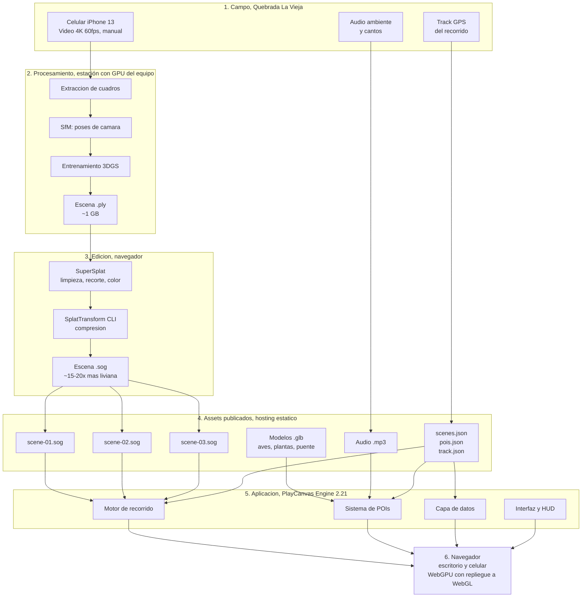
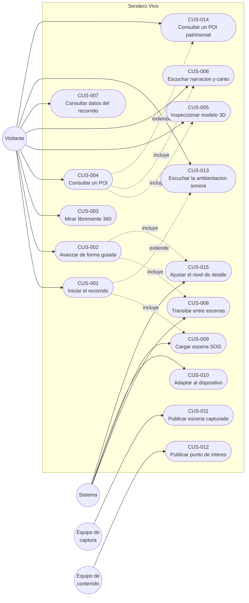
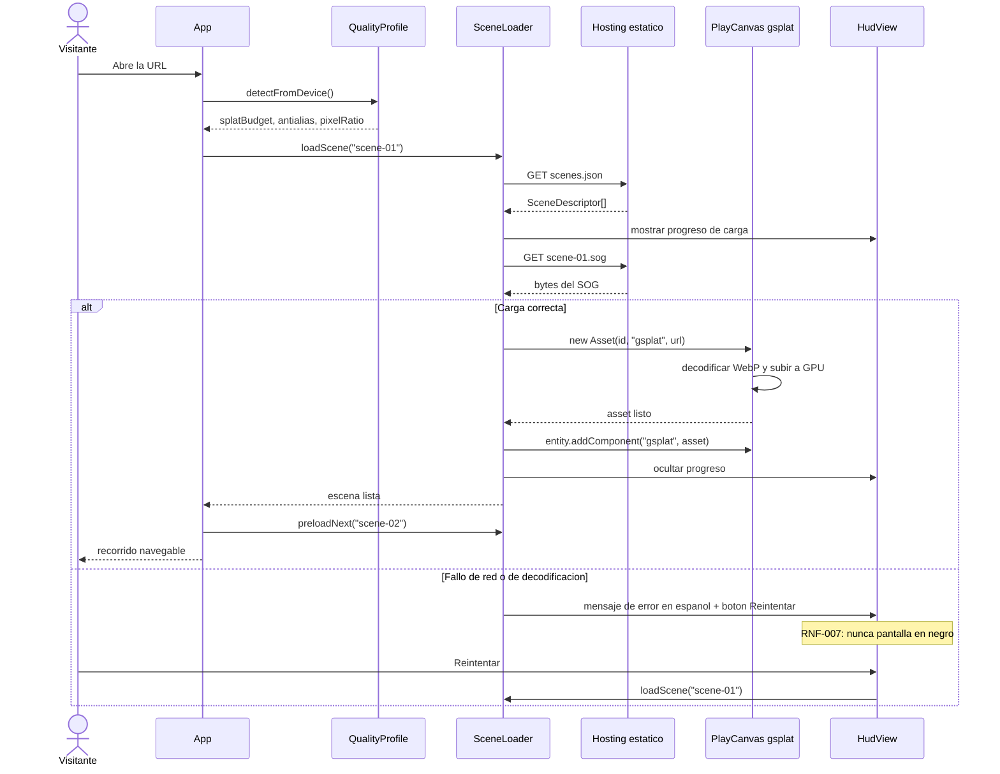
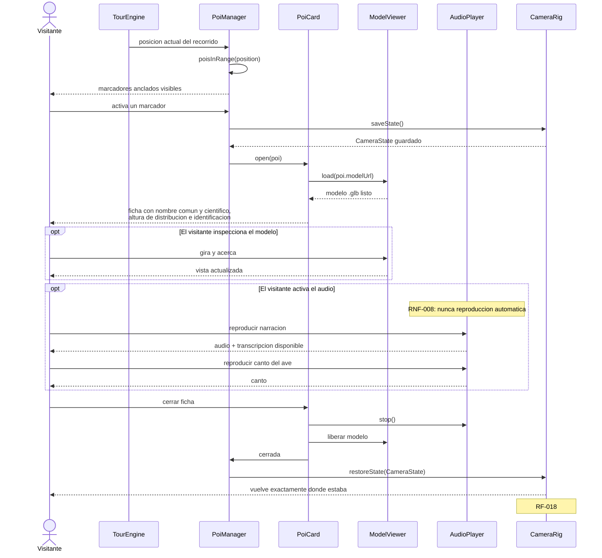
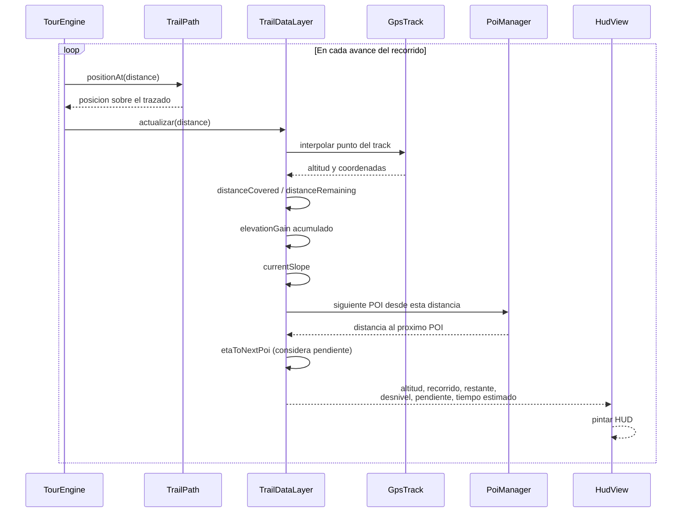
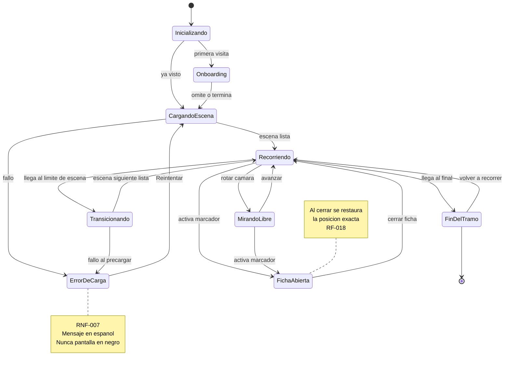

# Arquitectura: Sendero Vivo

> Versión 1,0, 11/08/2026 · Responsable: Juan Urrego
> Todos los diagramas están en Mermaid: GitHub los renderiza de forma nativa y una IA de código los lee como texto.

---

## 1. Visión general

Sendero Vivo es una **aplicación web estática**. No hay servidor de aplicación, no hay base de datos, no hay cuentas de usuario. Todo lo que el visitante ve son archivos servidos por HTTPS: tres escenas en formato SOG, un puñado de modelos `.glb`, audio, y dos archivos de configuración declarativos (`scenes.json` y `pois.json`) que gobiernan el contenido.

Esa simplicidad es deliberada. El proyecto tiene el riesgo concentrado en la **producción de contenido** (capturar y reconstruir un bosque) y en el **rendimiento del render en móvil**, no en la lógica de negocio. Cualquier complejidad de backend sería complejidad prestada.

### 1.1 Arquitectura de alto nivel (captura → navegador)



### 1.2 Qué tecnología vive dónde

| Capa | Tecnología | Dónde corre |
|---|---|---|
| Captura | Celular, ajustes manuales | Campo |
| Reconstrucción | SfM + entrenamiento 3DGS | Estación con GPU del equipo |
| Edición | SuperSplat (MIT) | Navegador, local |
| Compresión | SplatTransform CLI | Local |
| Render y lógica | PlayCanvas Engine 2.21.3 (MIT) | Navegador del visitante |
| Entrega | Hosting estático + HTTPS | |

---

## 2. Casos de uso



| ID | Caso de uso | Actor |
|---|---|---|
| CUS-001 | Iniciar el recorrido virtual | Visitante |
| CUS-002 | Avanzar por el sendero de forma guiada | Visitante |
| CUS-003 | Mirar libremente en 360° | Visitante |
| CUS-004 | Consultar un punto de interés | Visitante |
| CUS-005 | Inspeccionar el modelo 3D de la ficha | Visitante |
| CUS-006 | Escuchar la narración y el canto del ave | Visitante |
| CUS-007 | Consultar los datos del recorrido en pantalla | Visitante |
| CUS-008 | Transitar entre escenas del tramo | Sistema |
| CUS-009 | Cargar y descomprimir una escena SOG | Sistema |
| CUS-010 | Adaptar la experiencia al dispositivo | Sistema |
| CUS-011 | Procesar y publicar una escena capturada | Equipo de captura |
| CUS-012 | Registrar y publicar un punto de interés | Equipo de contenido |
| CUS-013 | Escuchar la ambientación sonora espacial del recorrido | Visitante |
| CUS-014 | Consultar un punto de interés patrimonial o histórico | Visitante |
| CUS-015 | Ajustar el nivel de detalle según la proximidad al recorrido | Sistema |

---

## 3. Modelo de dominio (módulos y clases)

Nombres en **inglés**, según la convención del proyecto.

```mermaid
classDiagram
    class TourEngine {
        -SceneLoader sceneLoader
        -TrailPath trailPath
        -CameraRig cameraRig
        -TourState state
        +start() void
        +moveForward(delta) void
        +moveBackward(delta) void
        +getProgress() number
    }

    class SceneLoader {
        -Map~string, GSplatAsset~ cache
        -QualityProfile profile
        +loadScene(sceneId) Promise
        +preloadNext(sceneId) void
        +unload(sceneId) void
    }

    class SceneDescriptor {
        +string id
        +number order
        +string sogUrl
        +Vector3 entryPoint
        +Vector3 exitPoint
        +string captureDate
    }

    class TrailPath {
        -Waypoint[] waypoints
        +positionAt(distance) Vector3
        +clampToTrail(position) Vector3
        +totalLength() number
    }

    class CameraRig {
        -number yaw
        -number pitch
        +look(deltaYaw, deltaPitch) void
        +saveState() CameraState
        +restoreState(state) void
    }

    class PoiManager {
        -PoiDescriptor[] pois
        +loadFromConfig(url) Promise
        +poisInRange(position) PoiDescriptor[]
        +activate(poiId) void
        +close() void
    }

    class PoiDescriptor {
        +string id
        +string type
        +string commonName
        +string scientificName
        +Vector3 anchor
        +string modelUrl
        +string idleAnimation
        +string narrationUrl
        +string transcriptUrl
        +string birdCallUrl
        +string altitudeRange
        +string fieldIdTips
        +string sightingTips
        +string historicalNote
        +string period
        +string sourceUrl
    }

    class PoiCard {
        -ModelViewer viewer
        -AudioPlayer audio
        +open(poi) void
        +close() void
    }

    class ModelViewer {
        +load(modelUrl) Promise
        +playIdle(clipName) void
        +rotate(dx, dy) void
        +zoom(delta) void
    }

    class LodController {
        -number lodBaseDistance
        -number lodMultiplier
        +applyProfile(profile) void
    }

    class AmbienceController {
        -boolean started
        -boolean muted
        +startOnUserGesture() void
        +setMuted(value) void
        +sourcesInRange(distance) SoundSourceDescriptor[]
    }

    class SpatialAudioSource {
        -string panningModel
        -number refDistance
        -number maxDistance
        +activate() void
        +deactivate() void
    }

    class SoundSourceDescriptor {
        +string id
        +string url
        +Vector3 anchor
        +number distanceMeters
        +number refDistanceMeters
        +number maxDistanceMeters
        +boolean loop
    }

    class AudioPlayer {
        -boolean autoplayAllowed
        +play(url) void
        +stop() void
        +showTranscript() void
    }

    class TrailDataLayer {
        -GpsTrack track
        +altitudeAt(distance) number
        +distanceCovered() number
        +distanceRemaining() number
        +elevationGain() number
        +currentSlope() number
        +etaToNextPoi() number
    }

    class GpsTrack {
        +TrackPoint[] points
        +number totalDistance
        +number totalElevationGain
    }

    class QualityProfile {
        +number splatBudget
        +boolean antialias
        +number maxPixelRatio
        +number lodBaseDistance
        +number lodMultiplier
        +number maxSpatialAudioSources
        +detectFromDevice() QualityProfile
    }

    class HudView {
        +render(data) void
    }

    TourEngine --> SceneLoader : usa
    TourEngine --> TrailPath : restringe con
    TourEngine --> CameraRig : controla
    TourEngine --> TrailDataLayer : consulta
    SceneLoader --> SceneDescriptor : lee
    SceneLoader --> QualityProfile : aplica
    PoiManager --> PoiDescriptor : gestiona
    PoiManager --> PoiCard : abre
    PoiCard --> ModelViewer : contiene
    PoiCard --> AudioPlayer : contiene
    TrailDataLayer --> GpsTrack : deriva de
    HudView --> TrailDataLayer : muestra
    PoiManager ..> TourEngine : pide guardar y restaurar camara
    TourEngine --> LodController : configura
    LodController --> QualityProfile : lee
    AmbienceController --> SpatialAudioSource : activa por distancia
    AmbienceController --> SoundSourceDescriptor : gestiona
    AmbienceController ..> QualityProfile : respeta maxSpatialAudioSources
    AmbienceController ..> TourEngine : escucha tour:progress
```

### Notas de diseño

- **`TourEngine` es el único que mueve la cámara.** `PoiManager` no la toca: pide a `TourEngine` que guarde y restaure el estado (RF-018).
- **`TrailPath.clampToTrail()` es el guardián de RF-004.** Ninguna posición llega a la cámara sin pasar por ahí. Es lo que impide el movimiento libre dentro de una reserva protegida.
- **`TrailDataLayer` no sabe nada de render.** Recibe una distancia recorrida y devuelve números. `HudView` los pinta. Esto permite probar la capa de datos sin motor.
- **`PoiDescriptor` se construye únicamente desde `pois.json`** (RF-021, RNF-009): añadir un POI no toca código. Lo mismo vale para `SoundSourceDescriptor` y `soundscape.json`.
- **`AmbienceController` no toca la cámara.** El oyente del audio espacial es la cámara activa, que ya mueve `TourEngine`; la espacialización se actualiza sola. El audio escucha `tour:progress` para decidir qué fuentes activar por distancia.
- **`LodController` es el único que escribe `lodBaseDistance` y `lodMultiplier`** (RF-027). Los lee de `QualityProfile`, no los codifica.
- **`ModelViewer.playIdle()` arranca la animación al abrir la ficha** (RF-029). Es la única animación que corre sin gesto del usuario, y se permite porque es visual: la regla de "nada automático" es del audio (RNF-008).

---

## 4. Flujos principales

### 4.1 Carga de una escena SOG (CUS-009)



### 4.2 Activación de un punto de interés (CUS-004, CUS-005, CUS-006)



### 4.3 Actualización de la capa de datos GPS (CUS-007)



---

## 5. Estados del ciclo de recorrido



---

## 6. Contratos de datos

Los tres archivos que gobiernan el contenido. **Cambiarlos es cambiar el producto; cambiar el motor no debería ser necesario para añadir contenido.**

### `scenes.json`

```json
{
  "version": 1,
  "trail": {
    "name": "Quebrada La Vieja, sector Claro de Luna, tramo de entrada",
    "totalLengthMeters": 200,
    "startAltitudeMeters": 2712,
    "elevationGainMeters": null,
    "averageSlopePercent": null
  },
  "scenes": [
    {
      "id": "scene-01",
      "order": 1,
      "sogUrl": "assets/scenes/scene-01.sog",
      "entryDistanceMeters": 0,
      "exitDistanceMeters": 70,
      "captureDate": "[por definir tras la captura V2]"
    }
  ]
}
```

> **200 m es el compromiso firme**, en tres etapas: 0–70, 70–140 y 140–200 m. Los cortes son provisionales y se ajustan en V1 a puntos naturales del sendero, porque una transición se disimula mejor donde el visitante ya está girando la cabeza.
> `elevationGainMeters` y `averageSlopePercent` van en `null` a propósito: están **`[por medir en campo]`** y se cierran en V1. Las cifras de 340 m / 62 m / 9 % de versiones anteriores corresponden al tramo de referencia evaluado en ADR-001, no al tramo comprometido.

### `pois.json`

```json
{
  "version": 1,
  "pois": [
    {
      "id": "poi-colibri-chillon",
      "type": "fauna",
      "commonName": "Colibrí chillón",
      "scientificName": "Colibri coruscans",
      "sceneId": "scene-01",
      "anchor": { "x": 0, "y": 0, "z": 0 },
      "distanceMeters": 0,
      "modelUrl": "assets/models/colibri-chillon.glb",
      "idleAnimation": "idle-flap",
      "narrationUrl": "assets/audio/colibri-narracion.mp3",
      "transcriptUrl": "assets/text/colibri-transcripcion.txt",
      "birdCallUrl": "assets/audio/colibri-canto.mp3",
      "altitudeRange": "1.700 – 3.500 msnm",
      "fieldIdTips": "[por completar]",
      "sightingTips": "[por completar tras V1]"
    },
    {
      "id": "poi-muro-antiguo",
      "type": "patrimonio",
      "commonName": "[por identificar en V1]",
      "sceneId": "scene-02",
      "anchor": { "x": 0, "y": 0, "z": 0 },
      "distanceMeters": 0,
      "modelUrl": "assets/models/muro-antiguo.glb",
      "historicalNote": "[por verificar]",
      "period": "[por verificar]",
      "sourceUrl": ""
    }
  ]
}
```

> `anchor` y `distanceMeters` quedan en `[por medir en campo]` hasta que existan las escenas reconstruidas y el track alineado.
> `type` admite `"fauna"`, `"flora"`, `"elemento"` y `"patrimonio"`. Los campos son por tipo: `idleAnimation`, `birdCallUrl` y `sightingTips` solo en `fauna`; `historicalNote`, `period` y `sourceUrl` solo en `patrimonio`, y **`sourceUrl` es obligatorio si la nota histórica afirma algo**.

### `soundscape.json`

```json
{
  "version": 1,
  "ambienceUrl": "assets/audio/ambience-bed.mp3",
  "sources": [
    {
      "id": "sound-stream-45",
      "label": "Cauce de la quebrada",
      "url": "assets/audio/stream-loop.mp3",
      "sceneId": "scene-01",
      "distanceMeters": 45,
      "anchor": { "x": 0, "y": 0, "z": 0 },
      "refDistanceMeters": 2,
      "maxDistanceMeters": 25,
      "loop": true
    }
  ]
}
```

> `ambienceUrl` es el lecho continuo: estéreo, **no posicional**. Cada entrada de `sources` es una fuente puntual espacializada con HRTF, grabada **en mono**. Las posiciones salen del mapa sonoro levantado en V1. Diseño completo en [`08-ambientacion-sonora.md`](08-ambientacion-sonora.md).

### `track.json` (track GPS)

```json
{
  "version": 1,
  "capturedOn": "[fecha real de la salida]",
  "points": [
    { "lat": 0.0, "lon": 0.0, "altitudeMeters": 2712, "distanceMeters": 0 }
  ]
}
```

> El track se graba el mismo día de la captura. Los valores reales entran tras la salida de campo del Sprint 1.

---

## 7. Decisiones de arquitectura

| Decisión | Alternativas descartadas | Razón |
|---|---|---|
| **Gaussian Splatting sobre captura real** | Modelado 3D a mano; fotogrametría de malla; NeRF | El producto es que el visitante *reconozca* el lugar. Solo la captura da eso, y 3DGS es el único que además corre en tiempo real en el navegador |
| **Formato SOG** | PLY plano; Compressed PLY | ~15–20× más liviano que PLY; datos en orden Morton, listos para GPU sin procesar al cargar. Es lo que hace viable el móvil |
| **Tres escenas separadas** | Una sola escena para todo el tramo | Permite cargar solo lo necesario y precargar la siguiente. Una escena única excedería el presupuesto de gaussianas en móvil |
| **Sitio estático, sin backend** | API + base de datos; CMS | No hay cuentas, ni datos de usuario, ni contenido dinámico. Un backend sería complejidad prestada |
| **Contenido declarativo en JSON** | POIs y escenas escritos en código | RF-021 y RNF-009: el equipo de contenido añade un POI sin tocar el motor ni recompilar |
| **WebGPU con repliegue a WebGL** | Solo WebGL; solo WebGPU | WebGL no tiene cómputo general y el ordenamiento por profundidad se va a CPU. WebGPU es mucho mejor, pero exigirlo rompería RNF-004 |
| **Recorrido sobre trazado, sin movimiento libre** | Cámara libre tipo videojuego | El sendero está dentro de una reserva protegida: el producto no puede insinuar salirse del camino (RF-004, RNF-015). Además acota el volumen a capturar |
| **Modelos de ficha aparte de la escena** | Modelar aves y plantas dentro del splat | Un ave no se captura por fotogrametría: se mueve. Y separarlos permite que E3 avance en paralelo a E1 |
| **LOD por distancia de cámara como "detalle por proximidad"** | LOD por campo de visión; densidad uniforme; recortar lo lejano | La cámara va siempre sobre el trazado (RF-004), así que distancia a cámara ≡ distancia al recorrido. Un LOD por campo de visión parpadearía al rotar 360°. Ver ADR-002 |
| **Audio en dos capas: lecho estéreo + fuentes HRTF** | Pista de fondo sin espacializar; ambisónica; espacializar todo | El lecho da continuidad barata y las fuentes dan el espacio. Ambisónica exige micrófono que no tenemos. Ver ADR-003 |
| **La ambientación arranca con el gesto de iniciar el recorrido** | Arrancar al cargar la página | RNF-008 y las políticas de autoplay del navegador. El botón anuncia el sonido y ofrece iniciar en silencio |
| **Tipo de POI `patrimonio` en el mismo contrato** | Un contrato aparte para lo no vivo | Es el mismo flujo: marcador, ficha, modelo. Cambian los campos, no el mecanismo. Y así RNF-009 sigue valiendo |

---

## 8. Reglas para no romper la arquitectura

Invariantes. Una PR que rompa cualquiera de estas se rechaza sin discusión.

1. **La cámara la mueve solo `TourEngine`.** Ningún otro módulo escribe posición ni rotación de cámara. `PoiCard` pide guardar y restaurar; no toca.
2. **Ninguna posición llega a la cámara sin pasar por `TrailPath.clampToTrail()`.** Es la garantía de RF-004.
3. **`TrailDataLayer` no importa nada de PlayCanvas.** Recibe números, devuelve números. Si necesita render, está mal diseñado.
4. **Añadir un POI no toca código.** Si para añadir un POI hay que editar un `.js`, se rompió RNF-009.
5. **Añadir o reordenar una escena no toca código.** Todo vive en `scenes.json`.
6. **El audio nunca arranca solo.** Toda reproducción nace de un gesto del usuario (RNF-008).
7. **Ningún estado de carga o de error deja la pantalla en negro.** Siempre hay progreso, mensaje o reintento (RNF-007).
8. **Todo texto visible está en español; todo identificador de código, en inglés.** Sin mezclas.
9. **Los assets pesados nunca entran a Git.** `*.ply`, `*.sog`, `assets/raw/` y el video de captura están en `.gitignore`.
10. **Nada de datos inventados.** Altitudes, distancias, nombres científicos y notas históricas se verifican o se marcan `[por medir en campo]` / `[por verificar]`.
11. **Ninguna funcionalidad sin RF.** Si no traza a un requerimiento, o sobra la funcionalidad o falta el requerimiento, y entonces se agrega el requerimiento primero.
12. **`src/audio/` no toca la cámara y `src/engine/` no reproduce sonido.** El oyente del audio espacial es la cámara activa que ya mueve `TourEngine`.
13. **Ningún módulo lee la cámara para saber dónde está el visitante.** Se escucha `tour:progress`, que publica `distanceMeters`.
14. **Ningún archivo `.js` escribe un color literal.** Todo color sale de `styles/tokens.css`.
15. **Añadir una fuente de sonido no toca código.** Todo vive en `soundscape.json`.

---

## 9. Estructura de carpetas prevista

```
SenderoVivo/
├── README.md
├── context-for-vibe-coding.md
├── .gitignore
├── docs/
│   ├── 01-principios-de-trabajo.md
│   ├── 02-vision-de-proyecto.md
│   ├── 03-avances-tecnologia.md
│   ├── 04-actividades-y-roles.md
│   ├── 05-catalogo-fauna-y-flora.md
│   ├── 06-identidad-visual.md
│   ├── 07-plan-de-visitas-de-campo.md
│   ├── 08-ambientacion-sonora.md
│   ├── 09-ambitos-de-los-tres-programadores.md
│   ├── 10-guion-de-la-presentacion.md
│   ├── arquitectura.md
│   ├── F_Analisis_de_Requerimientos_V1,0_SenderoVivo.docx
│   └── decisiones/
│       ├── ADR-001-eleccion-de-sendero.md
│       ├── ADR-002-lod-por-proximidad.md
│       ├── ADR-003-audio-binaural-espacial.md
│       └── ADR-004-reparto-de-ambitos.md
├── plan/
│   ├── plan_de_trabajo.md
│   └── backlog-jira.csv
├── scripts/
│   └── sync-github.mjs         Sincroniza GitHub desde plan/backlog-jira.csv
├── src/                        (código, desde el Sprint 3)
│   ├── app/                    Juan:      main.js, cableado, onboarding, estados
│   ├── engine/                 Alejandra: TourEngine, SceneLoader, TrailPath,
│   │                                      CameraRig, QualityProfile, LodController
│   ├── poi/                    David:     PoiManager, PoiCard, ModelViewer
│   ├── data/                   David:     TrailDataLayer, GpsTrack
│   ├── audio/                  David:     AmbienceController, SpatialAudioSource,
│   │                                      AudioPlayer
│   └── ui/                     Juan:      HudView y shell (diseño de Eybar + Alberto)
├── styles/                     Eybar + Alberto: tokens.css, componentes
├── config/
│   ├── scenes.json
│   ├── pois.json
│   ├── track.json
│   └── soundscape.json
└── assets/
    ├── raw/                    (ignorado por Git, video y capturas brutas)
    ├── scenes/                 (ignorado, .sog)
    ├── models/                 (.glb optimizados, con animación idle)
    ├── audio/
    └── text/
```

**Quién toca qué:** cada carpeta tiene un dueño y hay exactamente **tres fronteras** entre ámbitos, cada una con su contrato. Está detallado en [`09-ambitos-de-los-tres-programadores.md`](09-ambitos-de-los-tres-programadores.md). Esto es lo que evita que seis personas se pisen en catorce semanas.
